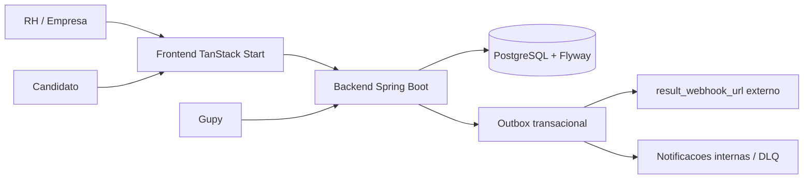

# Praxis - Plataforma de Avaliacao Comportamental Deterministica

Praxis e uma plataforma para criar, validar, publicar, aplicar, auditar e monitorar simulacoes comportamentais de recrutamento. O produto mede julgamento situacional por alternativas predefinidas, com score calculado por competencias, pesos e pontuacoes cadastradas, sem IA julgando candidato.

O sistema funciona como uma camada complementar a um ATS, hoje com integracao Gupy: a Gupy organiza o funil, o Praxis adiciona evidencia comportamental auditavel antes da entrevista.

## O que o sistema faz

- Permite que RH crie simulacoes situacionais para cargos e contextos reais.
- Estrutura a avaliacao em blueprint, competencias, turnos, alternativas, pesos e evidencias.
- Valida estruturalmente a qualidade minima da simulacao antes de publicar.
- Publica versoes imutaveis para execucao por candidatos.
- Gera links publicos de candidato, por integracao Gupy ou pela area interna da empresa.
- Aplica a simulacao em fluxo publico com token de tentativa.
- Calcula score deterministico por alternativa escolhida, competencia e peso.
- Mantem auditoria de criacao, edicao, publicacao, tentativa e resposta.
- Envia resultado para webhook externo por outbox transacional com retry e DLQ.
- Exibe monitoramento, governanca, LGPD, defensabilidade e comparacao de candidatos.

## O que o sistema nao promete

- Nao avalia texto livre automaticamente.
- Nao usa LLM ou IA generativa para julgar candidato.
- Nao substitui decisao humana em contexto sensivel.
- Nao e um ATS completo; integra-se a um ATS.
- Nao possui endpoint separado de "ativacao Gupy"; hoje existe preflight e publicacao.

## Modulos

```text
backend/    Spring Boot 3.5, Java 21, Maven, PostgreSQL, Flyway, Spring Security
frontend/   React 19, TanStack Start/Router, Vite, Tailwind; dev local com pnpm, Docker com npm ci
docs/       Documentacao tecnica, produto, UX, integracao e historico
```

### Backend

Pacote base: `br.com.iforce.praxis`.

Principais dominios:

- `auth`: login, JWT, empresa e roles.
- `simulation`: criacao, versoes, grafo, validacao, publicacao, monitoramento, quick-start e Talent Match.
- `journey`: jornadas de avaliacao (assessment journeys) que encadeiam varias simulacoes publicadas em um funil unico por candidato.
- `candidate`: fluxo publico do candidato e links internos.
- `results`: listagem e detalhe de resultados de tentativas, com registro da decisao do recrutador.
- `dashboard`: painel de indicadores da empresa autenticada.
- `gupy`: contrato externo `/test/**`, catalogo, tentativa e resultado.
- `recrutei`: segundo provedor ATS integrado, com contrato externo proprio.
- `shared.integration`: Central de Integracoes (`/api/v1/integrations`) que unifica Gupy, Recrutei e API propria, incluindo webhook e token de API publica.
- `marketplace`: marketplace de profissionais (anuncios, pedidos, mensagens, avaliacoes) com pagamentos Mercado Pago e moderacao pelo admin.
- `billing`: cobranca Mercado Pago (Parte B). AVULSO por credito pre-pago (saldo + ledger append-only), PROFISSIONAL por assinatura recorrente, ENTERPRISE por contrato manual. A leitura do plano/uso fica em `/api/v1/billing`; a criacao de cobrancas e sincronizacao com o Mercado Pago fica no painel ADMIN. Webhook publico (`POST /api/webhooks/mercado-pago`) com validacao de assinatura `x-signature`, idempotencia e consulta a API antes de aplicar mudanca financeira. Credenciais (`MP_ACCESS_TOKEN`, `MP_PUBLIC_KEY`, `MP_WEBHOOK_SECRET`) ficam apenas no backend, via variaveis de ambiente.
- `admin`: painel administrativo da plataforma (perfil `ADMIN`) para cadastrar e governar clientes (empresas), acompanhar uso, suspender, reativar e cancelar, com auditoria append-only. Cliente = `EmpresaEntity`; nao existe `CustomerEntity`.
- `team`: gestao dos usuarios da propria empresa (convite, bloqueio, reenvio de convite).
- `account`: conta do usuario logado (dados basicos e troca de senha).
- `companyprofile`: dados cadastrais da empresa autenticada.
- `term`: termo de responsabilidade do recrutador e termo de uso da vertical de Saude, com registro de aceite.
- `shared.outbox`: entrega assincrona de eventos/resultados.
- `audit`: trilha de eventos.
- `tenantconfig`: catalogos configuraveis por empresa (endpoint `/api/v1/empresa-config`).
- `media`: upload de imagem/audio para nos e alternativas.
- `privacy`: informacoes de conformidade LGPD.
- `shared.notification`: alertas internos, inclusive DLQ.
- `marketplace`: psicometria, anuncios, orders/payouts e Mercado Pago Connect. Desativado por padrao via `praxis.marketplace.enabled=false` (env `PRAXIS_MARKETPLACE_ENABLED`).

### Frontend

As telas ficam em `frontend/src/routes` e usam TanStack Router.

Navegacao principal da empresa (menu lateral em `frontend/src/components/app-shell.tsx`):

- `/dashboard`: painel inicial com indicadores da empresa.
- `/avaliacoes`: ver e editar as avaliacoes.
- `/results`: lista de resultados de tentativas; `/results/{attemptId}` detalha e registra a decisao do recrutador.
- `/enviar-link`: cria links internos para candidatos e acompanha tentativas ao vivo.
- `/integrations`: Central de Integracoes (Gupy, Recrutei e API propria); `/integrations/{provider}` detalha e configura cada provedor.
- `/monitoramento`: acompanha tentativas e entregas.
- `/jornadas`: jornadas de avaliacao que encadeiam varias avaliacoes.
- `/talent-match`: compara candidatos contra benchmark da versao.
- `/marketplace`: marketplace de profissionais.
- `/billing`: plano, uso e historico de cobranca.
- `/compliance`: analise operacional, defensabilidade e conformidade LGPD.
- `/competencias`: catalogos configuraveis da empresa.
- `/configuracoes/perfil`, `/configuracoes/conta` e `/team`: perfil da empresa, conta do usuario e equipe.

Fluxo de criacao (`/comecar` e assistente `/nova/**`):

- `/comecar`: pagina explicativa de entrada; leva a `/nova/avaliacao` (do zero) ou `/nova/rapido` (modelo pronto).
- `/nova/rapido`: cria uma avaliacao pre-preenchida a partir de um modelo (quick-start) e abre o editor.
- Assistente de 4 passos (`frontend/src/lib/simulation-meta.ts`): `/nova/avaliacao` (Teste), `/nova/personagem` (Cenario), `/nova/validador` (Revisao) e `/nova/governanca` (Publicacao).
- Rotas secundarias `/nova/objetivo`, `/nova/dialogo`, `/nova/mapa`, `/nova/piloto` e `/nova/gupy` seguem existindo, mas fora dos 4 passos do assistente; sao acessadas por links internos das telas ou pela URL direta.

Fluxo publico do candidato:

- `/candidato` e `/candidato/$token`: experiencia publica da avaliacao.
- `/jornada/$attemptId`: execucao publica de uma jornada de avaliacao.

Rotas legadas mantem redirecionamento: `/nova/blueprint` -> `/nova/avaliacao`, `/nova/competencias` -> `/competencias`, `/nova/avaliacoes` -> `/avaliacoes`, `/configuracoes/integracoes` -> `/integrations` e `/configuracoes/api` -> `/integrations/custom-api`.

## Arquitetura de alto nivel



## Fluxos principais

O assistente tem 4 passos (ver `frontend/src/lib/simulation-meta.ts`):

1. `/nova/avaliacao` (Teste): RH cria o rascunho e define objetivo, competencias, pesos e contexto.
2. `/nova/personagem` (Cenario): RH monta personagem, turnos, alternativas e midias.
3. `/nova/validador` (Revisao): validador calcula blockers, warnings e quality score.
4. `/nova/governanca` (Publicacao): publica a versao quando ela esta publicavel.

Versao publicada fica imutavel; edicoes futuras usam clone para novo rascunho. Alternativamente, `/nova/rapido` cria uma avaliacao pre-preenchida a partir de um modelo (quick-start).

### Candidato

1. A tentativa e criada pela Gupy (`POST /test/candidate`) ou pela empresa (`POST /api/v1/candidate-links`).
2. O candidato abre `/candidato/{token}`.
3. O frontend carrega `GET /candidate/attempts/{attemptToken}`.
4. Cada resposta usa `POST /candidate/attempts/{attemptToken}/answers`.
5. Ao completar, o backend calcula score e grava evento de resultado.

### Gupy e entrega de resultado

1. Gupy lista testes publicados com `GET /test`.
2. Gupy cria tentativa com `POST /test/candidate`.
3. Gupy pode consultar resultado com `GET /test/result/{resultId}?company_id=...`.
4. Quando ha `result_webhook_url`, o resultado tambem e enviado por outbox.
5. O outbox tenta entregar, aplica backoff e move para DLQ quando necessario.

## Endpoints principais

### Internos da empresa

| Area | Endpoint |
| --- | --- |
| Auth | `POST /api/v1/auth/login` |
| Dashboard | `GET /api/v1/dashboard` |
| Simulacoes | `GET /api/v1/simulations` |
| Criar rascunho | `POST /api/v1/simulations/drafts` |
| Detalhar versao | `GET /api/v1/simulations/{id}/versions/{n}` |
| Atualizar blueprint | `PATCH /api/v1/simulations/{id}/versions/{n}/blueprint` |
| CRUD de nos | `/api/v1/simulations/{id}/versions/{n}/nodes` |
| CRUD de alternativas | `/api/v1/simulations/{id}/versions/{n}/nodes/{nodeId}/options` |
| Validacao | `GET /api/v1/simulations/{id}/versions/{n}/validation` |
| Publicacao | `POST /api/v1/simulations/{id}/versions/{n}/publish` |
| Clone para rascunho | `POST /api/v1/simulations/{id}/versions/{n}/clone-draft` |
| Quick-start | `GET /api/v1/simulations/quick-start/templates`, `POST /api/v1/simulations/quick-start` |
| Preflight Gupy | `GET /api/v1/simulations/{id}/versions/{n}/gupy-preflight` |
| Monitoramento | `GET /api/v1/simulations/{id}/versions/{n}/monitoring` |
| Talent Match | `GET /api/v1/simulations/{id}/versions/{n}/talent-match?attemptIds=a,b` |
| Resultados | `GET /api/v1/results`, `GET /api/v1/results/{attemptId}`, `POST /api/v1/results/{attemptId}/decision` |
| Jornadas | `GET/POST /api/v1/assessment-journeys` e `/api/v1/assessment-journey-attempts` |
| Empresa config | `GET /api/v1/empresa-config`, `PUT /api/v1/empresa-config/{configType}` |
| Midia | `POST /api/v1/media` |
| Links de candidato | `GET/POST /api/v1/candidate-links` |
| Tentativas ao vivo | `GET /api/v1/candidate-links/live-attempts` |
| Integracoes | `GET /api/v1/integrations`, `GET /api/v1/integrations/{provider}` e acoes (`configure`, `sync`, `tokens`...) |
| Webhook/API propria | `GET/POST /api/v1/integrations/custom-api/webhook`, `POST/DELETE /api/v1/integrations/custom-api/api-token` |
| Auditoria | `GET /api/v1/audit/simulations/{id}/versions/{n}` |
| Privacidade | `GET /api/v1/privacy/compliance` |
| Entregas Gupy | `GET /api/v1/gupy/result-deliveries` |
| Reprocessar entrega | `POST /api/v1/gupy/result-deliveries/{deliveryId}/reprocess` |
| Notificacoes | `GET /api/v1/notifications` |
| Plano/cobranca | `GET /api/v1/billing`, `GET /api/v1/billing/events` |
| Equipe | `GET/POST /api/v1/team` (convite, bloqueio) |
| Conta | `GET /api/v1/account/me`, `POST /api/v1/account/password` |
| Perfil da empresa | `GET /api/v1/company-profile` |
| Termos | `GET/POST /api/v1/terms/responsibility`, `GET/POST /api/v1/terms/health-use` |
| Marketplace | `/api/v1/marketplace/{listings,professionals,orders,messages,reviews}` |
| Admin plataforma | `/api/admin/{dashboard,empresas,audit}` e `/api/v1/admin/marketplace` (perfil `ADMIN`) |

### Publicos e integracao

| Area | Endpoint |
| --- | --- |
| Catalogo Gupy | `GET /test` |
| Criar tentativa Gupy | `POST /test/candidate` |
| Resultado Gupy | `GET /test/result/{resultId}?company_id={companyId}` |
| Integracao Recrutei | contrato externo proprio do provedor Recrutei |
| Webhook Mercado Pago | `POST /api/webhooks/mercado-pago` |
| Estado da tentativa | `GET /candidate/attempts/{attemptToken}` |
| Enviar resposta | `POST /candidate/attempts/{attemptToken}/answers` |
| Jornada publica | `GET /candidate/journey-attempts/{attemptId}` e passos (`start`, `complete`, `result`) |
| Redirecionamento publico | `GET /candidato/{token}` |

Observacao Gupy: o backend retorna `test_url` ja apontando para a pagina do candidato em `/candidato/{token}` (base `PRAXIS_CANDIDATE_PAGE_BASE_URL`), pronta para abrir no navegador.

## Estados importantes

| Entidade | Estados |
| --- | --- |
| Versao de simulacao | `draft`, `published`, `archived` |
| Tentativa | `notStarted`, `inProgress`, `paused`, `completed`, `abandoned`, `expired`, `failed` |
| Entrega outbox | `pending`, `retrying`, `sent`, `dlq` |
| Validacao | `warning`, `blocker` |

## Seguranca e empresa

- `PRAXIS_SECURITY_ENABLED=true` exige JWT nas rotas internas.
- `PRAXIS_SECURITY_ENABLED=false` libera rotas e usa `PRAXIS_DEFAULT_EMPRESA_ID`.
- Rotas `/test/**` (Gupy) e `/recrutei/test/**` validam o Bearer token de integracao calculando o SHA-256 Base64URL do token e comparando com a tabela `integration_tokens` (por provider), via `IntegrationAuthService`.
- Rotas internas exigem role `EMPRESA` quando a seguranca esta ativa.
- O empresa e carregado no contexto e usado para isolar simulacoes, tentativas, auditoria e entregas.

## Variaveis de ambiente

### Backend

| Variavel | Uso |
| --- | --- |
| `DB_HOST`, `DB_PORT`, `DB_NAME`, `DB_USER`, `DB_PASS` | Conexao PostgreSQL. |
| `DB_SCHEMA` | Schema usado por Flyway/JPA. |
| `PRAXIS_SECURITY_ENABLED` | Liga/desliga seguranca interna. |
| `PRAXIS_DEFAULT_EMPRESA_ID` | Empresa usado quando seguranca esta desligada. |
| `PRAXIS_INTEGRATION_TOKEN` | Exigida no `docker-compose.yml`, mas o backend atual nao le essa env para autenticar Gupy/Recrutei. Os tokens de `/test/**` sao cadastrados pela area de Integracoes da empresa e guardados hasheados em `integration_tokens`. |
| `PRAXIS_JWT_SECRET` | Segredo para JWT. |
| `PRAXIS_PUBLIC_BASE_URL` | Base publica usada em links e resultados. |
| `PRAXIS_CANDIDATE_PAGE_BASE_URL` | Base publica do fluxo do candidato. |
| `PRAXIS_PRIVACY_RETENTION_DAYS` | Retencao LGPD. |
| `PRAXIS_MARKETPLACE_ENABLED` | Liga/desliga o modulo de marketplace. Padrao `false`; desligado bloqueia as rotas `/api/v1/marketplace/**` e `/api/v1/admin/marketplace/**`, o scheduler de repasse e o webhook de marketplace. |
| `OBJECT_STORAGE_*` | Configuracao opcional de armazenamento de midia. |

### Frontend

| Variavel | Uso |
| --- | --- |
| `PRAXIS_API_BASE_URL` ou `VITE_PRAXIS_API_BASE_URL` | Base backend usada pelo servidor SSR/proxy. |
| `PRAXIS_BROWSER_API_BASE_URL` ou `VITE_PRAXIS_BROWSER_API_BASE_URL` | Base exposta ao browser quando nao usar proxy same-origin. |

## Rodando localmente

### Banco de dados

Suba um PostgreSQL local ou use Docker Compose. O backend espera PostgreSQL em `localhost:5432` por padrao.

Com Docker Compose, para subir somente o banco:

```bash
docker compose up postgres
```

### Backend

```bash
cd backend
mvn spring-boot:run
```

Backend: `http://localhost:8080`

Swagger UI fica em `/docs` apenas quando `SPRINGDOC_SWAGGER_UI_ENABLED=true`.

### Frontend

Para desenvolvimento local, use `pnpm`. O Dockerfile usa `npm ci` porque o build de container segue `package-lock.json`.

```bash
cd frontend
pnpm install
pnpm dev
```

Frontend: normalmente `http://localhost:5173`.

## Docker Compose

Crie `.env` na raiz:

```bash
POSTGRES_USER=praxis
POSTGRES_PASSWORD=troque-esta-senha
PRAXIS_INTEGRATION_TOKEN=troque-este-token
PRAXIS_JWT_SECRET=troque-este-segredo-com-tamanho-suficiente
PRAXIS_SECURITY_ENABLED=true
```

Observacao importante: `PRAXIS_INTEGRATION_TOKEN` e exigida pelo Compose, mas a autenticacao real de `/test/**` (Gupy) e `/recrutei/test/**` nao le essa env. O token de integracao e cadastrado pela area de Integracoes da empresa (por exemplo `POST /api/v1/integrations/{provider}/tokens`), que gera um token `prx_...`, retorna o valor em claro uma unica vez e guarda apenas o SHA-256 Base64URL dele na tabela `integration_tokens`. A cada requisicao, o backend calcula o mesmo hash do Bearer recebido e o compara com essa tabela.

Suba:

```bash
docker compose up --build
```

Servicos:

- Backend: `http://localhost:8080`
- Frontend: `http://localhost`
- PostgreSQL: rede interna do Compose

## Verificacao

```bash
cd backend
mvn test
```

```bash
cd frontend
pnpm build
```

Para uma checagem rapida de documentacao:

```bash
rg -n "api key antiga|callback de retorno" README.md docs frontend/src/routes/README.md
```

## Documentacao

- [Indice de documentacao](docs/00-INDICE.md)
- [Documentacao operacional](docs/OPERACAO.md)
- [Documentacao de implantacao](docs/IMPLANTACAO.md)
- [Cadastro de cenarios para RH](docs/cadastro_cenarios_rh.md)
- [Mapa Frontend-Backend](docs/frontend-backend-map.md)
- [Integracao Gupy](docs/INTEGRACAO-GUPY-PROVEDOR.md)
- [Arquitetura Outbox](docs/ARQUITETURA_OUTBOX_PATTERN.md)
- [Rotas TanStack Start](frontend/src/routes/README.md)
- [Resumo de implementacao](docs/IMPLEMENTATION_SUMMARY.md)

Ultima revisao operacional: 03/07/2026.
