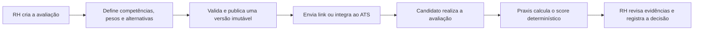
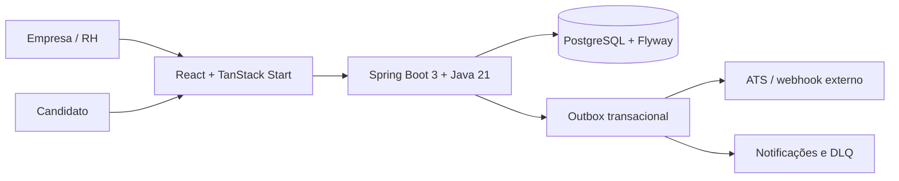

# Praxis

> Avaliações situacionais estruturadas para recrutamento, com critérios explícitos, score determinístico e trilha auditável.

O Praxis complementa o ATS: organiza evidências comportamentais antes da entrevista, sem usar IA generativa para julgar candidatos.

## Por que existe

Processos seletivos precisam de critérios claros e revisão humana. No Praxis, cada alternativa possui pesos e pontuações definidos pela empresa. O resultado é calculado de forma reproduzível, mantendo o histórico da avaliação, das respostas e das decisões operacionais.

## O que a plataforma entrega

- Criação guiada de avaliações situacionais por competência.
- Validação de estrutura e qualidade antes da publicação.
- Versionamento imutável: uma versão publicada preserva seu histórico.
- Links públicos para candidatos e jornadas com múltiplas avaliações.
- Resultados por competência, comparação de candidatos e registro de decisão do recrutador.
- Auditoria, monitoramento de entregas, retry e DLQ para integrações.
- Integrações técnicas com Gupy, Recrutei e API própria.

> A integração Gupy possui endpoints e entrega assíncrona implementados, mas ainda não deve ser apresentada como homologada. O estado de compatibilidade com o contrato oficial está em [docs/INTEGRACAO-GUPY-PROVEDOR.md](docs/INTEGRACAO-GUPY-PROVEDOR.md).

## Fluxo do produto



## Demonstração visual

As capturas abaixo devem usar dados fictícios ou anonimizados. O guia de produção está em [docs/screenshots/README.md](docs/screenshots/README.md).

| Tela | Evidência que deve mostrar |
| --- | --- |
| Dashboard | Visão consolidada de avaliações, tentativas e resultados. |
| Criação de avaliação | Competências, pesos e contexto configurados pelo RH. |
| Validador | Bloqueios, alertas e qualidade antes da publicação. |
| Experiência do candidato | Fluxo público de resposta por alternativa. |
| Resultado | Score por competência, evidências e decisão humana. |

## Arquitetura



## Stack

| Camada | Tecnologias |
| --- | --- |
| Backend | Java 21, Spring Boot, Spring Security, JPA, Flyway |
| Dados | PostgreSQL |
| Frontend | React 19, TanStack Start/Router, TypeScript, Tailwind |
| Qualidade | Maven, Testcontainers, GitHub Actions, ESLint e Prettier |
| Infraestrutura | Docker Compose, PostgreSQL e armazenamento compatível com S3 |

## O que o Praxis não faz

- Não usa LLM ou IA generativa para avaliar texto livre ou decidir sobre candidatos.
- Não promete eliminar vieses; oferece critérios explícitos, auditáveis e revisáveis.
- Não substitui a decisão humana em um contexto sensível.
- Não é um ATS completo; integra-se ao fluxo do ATS.

## Executando localmente

Pré-requisitos: Docker e Docker Compose.

Crie um arquivo `.env` na raiz do repositório:

```bash
POSTGRES_USER=praxis
POSTGRES_PASSWORD=troque-esta-senha
PRAXIS_INTEGRATION_TOKEN=valor-legado-exigido-pelo-compose
PRAXIS_JWT_SECRET=troque-este-segredo
```

> `PRAXIS_INTEGRATION_TOKEN` ainda é exigida pelo `docker-compose.yml`, mas não autentica `/test/**`. As integrações Gupy e Recrutei usam tokens gerados na Central de Integrações e persistidos somente como SHA-256 Base64URL na tabela `integration_tokens`.

```bash
docker compose up --build
```

- Frontend: `http://localhost`
- Backend: `http://localhost:8080`

## Documentação técnica

A documentação detalhada de arquitetura, módulos, endpoints e decisões de produto está em [`docs/`](docs/).

## Qualidade contínua

Cada push e pull request para `main` executa build e testes do backend com PostgreSQL real via Testcontainers, além do build do frontend.
