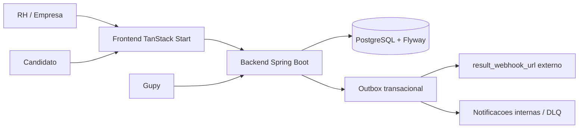

# Praxis - Plataforma de Avaliacao Comportamental Deterministica

Praxis e uma plataforma para criar, validar, publicar, aplicar, auditar e monitorar simulacoes comportamentais de recrutamento. O produto mede julgamento situacional por alternativas predefinidas, com score calculado por competencias, pesos e pontuacoes cadastradas, sem IA julgando candidato.

O sistema funciona como uma camada complementar a um ATS, hoje com integracao Gupy: a Gupy organiza o funil, o Praxis adiciona evidencia comportamental auditavel antes da entrevista.

## O que o sistema faz

- Permite que RH crie simulacoes situacionais para cargos e contextos reais.
- Estrutura a avaliacao em blueprint, competencias, turnos, alternativas, pesos e evidencias.
- Valida estruturalmente a qualidade minima da simulacao antes de publicar.
- Publica versoes imutaveis para execucao por candidatos.
- Gera links publicos de candidato, por integracao Gupy ou pela area interna da empresa.
- Aplica a simulacao em fluxo publico com token de tentativa.
- Calcula score deterministico por alternativa escolhida, competencia e peso.
- Mantem auditoria de criacao, edicao, publicacao, tentativa e resposta.
- Envia resultado para webhook externo por outbox transacional com retry e DLQ.
- Exibe monitoramento, governanca, LGPD, defensabilidade e comparacao de candidatos.

## O que o sistema nao promete

- Nao avalia texto livre automaticamente.
- Nao usa LLM ou IA generativa para julgar candidato.
- Nao substitui decisao humana em contexto sensivel.
- Nao e um ATS completo; integra-se a um ATS.
- Nao possui endpoint separado de "ativacao Gupy"; hoje existe preflight e publicacao.

## Modulos

```text
backend/    Spring Boot 3.5, Java 21, Maven, PostgreSQL, Flyway, Spring Security
frontend/   React 19, TanStack Start/Router, Vite, Tailwind; dev local com pnpm, Docker com npm ci
docs/       Documentacao tecnica, produto, UX, integracao e historico
```

### Backend

Pacote base: `br.com.iforce.praxis`.

Principais dominios:

- `auth`: login, JWT, empresa e roles.
- `admin`: painel administrativo da plataforma (perfil `ADMIN`) para cadastrar e governar clientes (empresas), acompanhar uso, suspender, reativar e cancelar, com auditoria append-only. Cliente = `EmpresaEntity`; nao existe `CustomerEntity`.
- `billing`: cobranca Mercado Pago (Parte B). AVULSO por credito pre-pago (saldo + ledger append-only), PROFISSIONAL por assinatura recorrente, ENTERPRISE por contrato manual. Webhook publico com validacao de assinatura, idempotencia e consulta a API antes de aplicar mudanca financeira. Credenciais (`MP_ACCESS_TOKEN`, `MP_PUBLIC_KEY`, `MP_WEBHOOK_SECRET`) ficam apenas no backend, via variaveis de ambiente.
- `simulation`: criacao, versoes, grafo, validacao, publicacao, monitoramento e Talent Match.
- `candidate`: fluxo publico do candidato e links internos.
- `gupy`: contrato externo `/test/**`, catalogo, tentativa e resultado.
- `shared.outbox`: entrega assincrona de eventos/resultados.
- `audit`: trilha de eventos.
- `empresaconfig`: catalogos configuraveis por empresa.
- `media`: upload de imagem/audio para nos e alternativas.
- `privacy`: informacoes de conformidade LGPD.
- `notification`: alertas internos, inclusive DLQ.

### Frontend

As telas ficam em `frontend/src/routes` e usam TanStack Router.

Principais rotas:

- `/app`: painel de simulacoes.
- `/comecar`: entrada do fluxo de criacao.
- `/nova/blueprint`: cria rascunho da avaliacao.
- `/nova/competencias`: configura catalogos do empresa.
- `/nova/objetivo`: ajusta plano, competencias e pesos.
- `/nova/personagem`: define o primeiro turno/personagem.
- `/nova/dialogo`: edita grafo, alternativas e midias.
- `/nova/validador`: valida blockers e warnings.
- `/nova/piloto`: acompanha sinais de piloto/monitoramento.
- `/nova/mapa`: mostra mapa de score e ramificacoes.
- `/nova/governanca`: publica, clona e consulta auditoria.
- `/nova/gupy`: executa preflight Gupy e consulta entregas.
- `/enviar-link`: cria links internos para candidatos.
- `/monitoramento`: acompanha tentativas e entregas.
- `/talent-match`: compara candidatos contra benchmark da versao.
- `/defensabilidade`: explica por que o score se sustenta.
- `/lgpd`: apresenta indicacoes de bases legais, retencao e explicabilidade.
- `/candidato` e `/candidato/$token`: experiencia publica do candidato.

## Arquitetura de alto nivel



## Fluxos principais

### Criacao e publicacao

1. RH cria um rascunho em `/nova/blueprint`.
2. RH define objetivo, competencias, pesos e contexto.
3. RH monta personagem, turnos, alternativas e midias.
4. Validador calcula blockers, warnings e quality score.
5. Governanca publica a versao quando ela esta publicavel.
6. Versao publicada fica imutavel; edicoes futuras usam clone para novo rascunho.

### Candidato

1. A tentativa e criada pela Gupy (`POST /test/candidate`) ou pela empresa (`POST /api/v1/candidate-links`).
2. O candidato abre `/candidato/{token}`.
3. O frontend carrega `GET /candidate/attempts/{attemptToken}`.
4. Cada resposta usa `POST /candidate/attempts/{attemptToken}/answers`.
5. Ao completar, o backend calcula score e grava evento de resultado.

### Gupy e entrega de resultado

1. Gupy lista testes publicados com `GET /test`.
2. Gupy cria tentativa com `POST /test/candidate`.
3. Gupy pode consultar resultado com `GET /test/result/{resultId}?company_id=...`.
4. Quando ha `result_webhook_url`, o resultado tambem e enviado por outbox.
5. O outbox tenta entregar, aplica backoff e move para DLQ quando necessario.

## Endpoints principais

### Internos da empresa

| Area | Endpoint |
| --- | --- |
| Auth | `POST /api/v1/auth/login` |
| Simulacoes | `GET /api/v1/simulations` |
| Criar rascunho | `POST /api/v1/simulations/drafts` |
| Detalhar versao | `GET /api/v1/simulations/{id}/versions/{n}` |
| Atualizar blueprint | `PATCH /api/v1/simulations/{id}/versions/{n}/blueprint` |
| CRUD de nos | `/api/v1/simulations/{id}/versions/{n}/nodes` |
| CRUD de alternativas | `/api/v1/simulations/{id}/versions/{n}/nodes/{nodeId}/options` |
| Validacao | `GET /api/v1/simulations/{id}/versions/{n}/validation` |
| Publicacao | `POST /api/v1/simulations/{id}/versions/{n}/publish` |
| Clone para rascunho | `POST /api/v1/simulations/{id}/versions/{n}/clone-draft` |
| Preflight Gupy | `GET /api/v1/simulations/{id}/versions/{n}/gupy-preflight` |
| Monitoramento | `GET /api/v1/simulations/{id}/versions/{n}/monitoring` |
| Talent Match | `GET /api/v1/simulations/{id}/versions/{n}/talent-match?attemptIds=a,b` |
| Empresa config | `GET /api/v1/empresa-config`, `PUT /api/v1/empresa-config/{configType}` |
| Midia | `POST /api/v1/media` |
| Links de candidato | `GET/POST /api/v1/candidate-links` |
| Tentativas ao vivo | `GET /api/v1/candidate-links/live-attempts` |
| Auditoria | `GET /api/v1/audit/simulations/{id}/versions/{n}` |
| Privacidade | `GET /api/v1/privacy/compliance` |
| Entregas Gupy | `GET /api/v1/gupy/result-deliveries` |
| Reprocessar entrega | `POST /api/v1/gupy/result-deliveries/{deliveryId}/reprocess` |
| Notificacoes | `GET /api/v1/notifications` |

### Publicos e integracao

| Area | Endpoint |
| --- | --- |
| Catalogo Gupy | `GET /test` |
| Criar tentativa Gupy | `POST /test/candidate` |
| Resultado Gupy | `GET /test/result/{resultId}?company_id={companyId}` |
| Estado da tentativa | `GET /candidate/attempts/{attemptToken}` |
| Enviar resposta | `POST /candidate/attempts/{attemptToken}/answers` |
| Redirecionamento publico | `GET /candidato/{token}` |

Observacao Gupy: o backend atual retorna `test_url` como URL de API em `/candidate/attempts/{token}`. Se a homologacao exigir URL de browser para o candidato, isso precisa ser ajustado no backend/configuracao para apontar para `/candidato/{token}` no frontend.

## Estados importantes

| Entidade | Estados |
| --- | --- |
| Versao de simulacao | `draft`, `published`, `archived` |
| Tentativa | `notStarted`, `inProgress`, `paused`, `completed`, `abandoned`, `expired`, `failed` |
| Entrega outbox | `pending`, `retrying`, `sent`, `dlq` |
| Validacao | `warning`, `blocker` |

## Seguranca e empresa

- `PRAXIS_SECURITY_ENABLED=true` exige JWT nas rotas internas.
- `PRAXIS_SECURITY_ENABLED=false` libera rotas e usa `PRAXIS_DEFAULT_EMPRESA_ID`.
- Rotas `/test/**` validam Bearer token de integracao comparando SHA-256 Base64URL do token com `empresas.integration_token_hash`.
- Rotas internas exigem role `EMPRESA` quando a seguranca esta ativa.
- O empresa e carregado no contexto e usado para isolar simulacoes, tentativas, auditoria e entregas.

## Variaveis de ambiente

### Backend

| Variavel | Uso |
| --- | --- |
| `DB_HOST`, `DB_PORT`, `DB_NAME`, `DB_USER`, `DB_PASS` | Conexao PostgreSQL. |
| `DB_SCHEMA` | Schema usado por Flyway/JPA. |
| `PRAXIS_SECURITY_ENABLED` | Liga/desliga seguranca interna. |
| `PRAXIS_DEFAULT_EMPRESA_ID` | Empresa usado quando seguranca esta desligada. |
| `PRAXIS_INTEGRATION_TOKEN` | Exigida no `docker-compose.yml`, mas o backend atual nao le essa env diretamente para autenticar Gupy. Para `/test/**`, configure `empresas.integration_token_hash` no banco. |
| `PRAXIS_JWT_SECRET` | Segredo para JWT. |
| `PRAXIS_PUBLIC_BASE_URL` | Base publica usada em links e resultados. |
| `PRAXIS_CANDIDATE_PAGE_BASE_URL` | Base publica do fluxo do candidato. |
| `PRAXIS_PRIVACY_RETENTION_DAYS` | Retencao LGPD. |
| `OBJECT_STORAGE_*` | Configuracao opcional de armazenamento de midia. |

### Frontend

| Variavel | Uso |
| --- | --- |
| `PRAXIS_API_BASE_URL` ou `VITE_PRAXIS_API_BASE_URL` | Base backend usada pelo servidor SSR/proxy. |
| `PRAXIS_BROWSER_API_BASE_URL` ou `VITE_PRAXIS_BROWSER_API_BASE_URL` | Base exposta ao browser quando nao usar proxy same-origin. |

## Rodando localmente

### Banco de dados

Suba um PostgreSQL local ou use Docker Compose. O backend espera PostgreSQL em `localhost:5432` por padrao.

Com Docker Compose, para subir somente o banco:

```bash
docker compose up postgres
```

### Backend

```bash
cd backend
mvn spring-boot:run
```

Backend: `http://localhost:8080`

Swagger UI fica em `/docs` apenas quando `SPRINGDOC_SWAGGER_UI_ENABLED=true`.

### Frontend

Para desenvolvimento local, use `pnpm`. O Dockerfile usa `npm ci` porque o build de container segue `package-lock.json`.

```bash
cd frontend
pnpm install
pnpm dev
```

Frontend: normalmente `http://localhost:5173`.

## Docker Compose

Crie `.env` na raiz:

```bash
POSTGRES_USER=praxis
POSTGRES_PASSWORD=troque-esta-senha
PRAXIS_INTEGRATION_TOKEN=troque-este-token
PRAXIS_JWT_SECRET=troque-este-segredo-com-tamanho-suficiente
PRAXIS_SECURITY_ENABLED=true
```

Observacao importante: `PRAXIS_INTEGRATION_TOKEN` e exigida pelo Compose, mas a autenticacao real da Gupy usa o hash salvo em `empresas.integration_token_hash`. Para ambiente local, gere o hash e atualize o empresa:

```bash
node -e "const crypto=require('crypto'); console.log(crypto.createHash('sha256').update('troque-este-token').digest('base64url'))"
```

```sql
UPDATE empresas
SET integration_token_hash = '<hash-gerado>'
WHERE id = 'empresa-1';
```

Suba:

```bash
docker compose up --build
```

Servicos:

- Backend: `http://localhost:8080`
- Frontend: `http://localhost`
- PostgreSQL: rede interna do Compose

## Verificacao

```bash
cd backend
mvn test
```

```bash
cd frontend
pnpm build
```

Para uma checagem rapida de documentacao:

```bash
rg -n "api key antiga|callback de retorno" README.md docs frontend/src/routes/README.md
```

## Documentacao

- [Indice de documentacao](docs/00-INDICE.md)
- [Documentacao operacional](docs/OPERACAO.md)
- [Documentacao de implantacao](docs/IMPLANTACAO.md)
- [Cadastro de cenarios para RH](docs/cadastro_cenarios_rh.md)
- [Mapa Frontend-Backend](docs/frontend-backend-map.md)
- [Integracao Gupy](docs/INTEGRACAO-GUPY-PROVEDOR.md)
- [Arquitetura Outbox](docs/ARQUITETURA_OUTBOX_PATTERN.md)
- [Rotas TanStack Start](frontend/src/routes/README.md)
- [Resumo de implementacao](docs/IMPLEMENTATION_SUMMARY.md)

Ultima revisao operacional: 20/06/2026.
