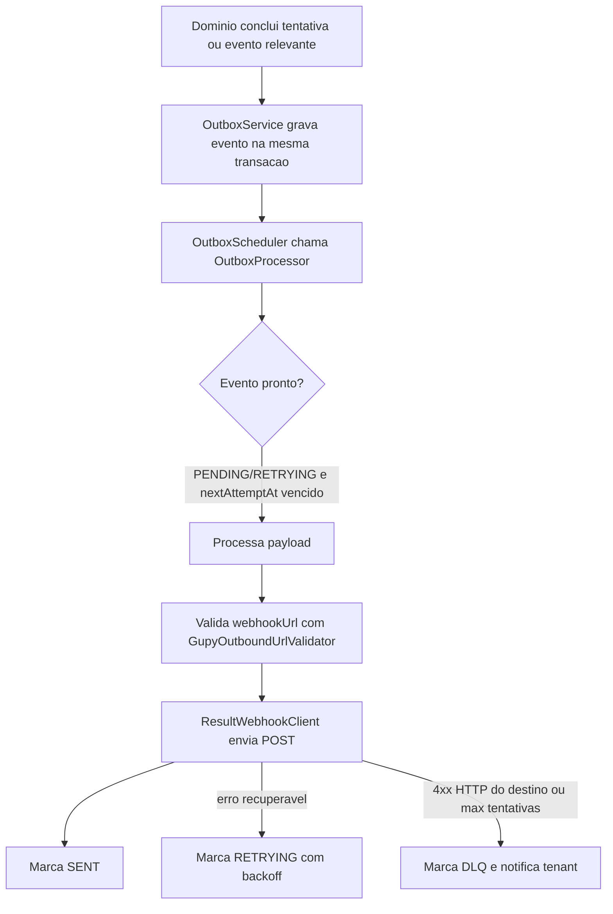

# Arquitetura de Outbox e Integracao ATS

> **Proposito:** documentar o outbox transacional usado para entregar eventos e resultados externos.

## Estado atual

- A integracao operacional implementada e Gupy.
- Nao ha registry generico de ATS nem adapters futuros registrados como beans Spring.
- A fila real usa `outbox_events`, `OutboxService`, `OutboxProcessor` e `OutboxScheduler`.
- O monitoramento interno reutiliza a API `/api/v1/gupy/result-deliveries`, que le os eventos do outbox em formato de entrega.

## Fluxo



## Eventos processados

| Evento | Uso |
| --- | --- |
| `RESULT_READY` | Envia `TestResultResponse` para `result_webhook_url`. |
| `ATTEMPT_STARTED` | Envia evento de engajamento quando ha webhook configurado. |
| `ATTEMPT_ABANDONED` | Envia evento de abandono quando ha webhook configurado. |

## Status do outbox

| Status | Significado |
| --- | --- |
| `PENDING` | Criado e aguardando primeiro processamento. |
| `RETRYING` | Falhou, mas sera tentado novamente em `nextAttemptAt`. |
| `SENT` | Enviado com sucesso. |
| `DLQ` | Falha permanente ou limite de tentativas atingido. |

## Retry e DLQ

`OutboxProcessor` usa no maximo 5 tentativas:

| Tentativa | Delay |
| --- | --- |
| 1 | 1 segundo |
| 2 | 4 segundos |
| 3 | 16 segundos |
| 4 | 64 segundos |
| 5+ | DLQ |

Erros HTTP 4xx sao tratados como erro de contrato e vao para DLQ sem continuar tentando.

Erros de rede, DNS, URL invalida, parsing de payload ou falha inesperada entram no fluxo normal de retry ate o limite de tentativas, salvo quando a excecao for classificada como erro permanente pelo processador.

Quando um evento vai para DLQ, `ResultDeliveryDlqAlertService` cria notificacao interna para administradores do tenant.

## Componentes

| Classe | Responsabilidade |
| --- | --- |
| `OutboxEventEntity` | Entidade persistida com tenant, payload, status, tentativas e timestamps. |
| `OutboxService` | Cria eventos dentro da transacao de negocio. |
| `OutboxProcessor` | Processa eventos prontos, aplica retry e DLQ. |
| `OutboxScheduler` | Aciona processamento periodico. |
| `ResultWebhookClient` | Interface de envio HTTP. |
| `RestClientResultWebhookClient` | Implementacao HTTP concreta. |
| `GupyOutboundUrlValidator` | Valida URL de saida antes de postar. |
| `OutboxResultDeliveryService` | API de consulta/reprocessamento para `/api/v1/gupy/result-deliveries`. |

## Monitoramento e operacao

```text
GET  /api/v1/gupy/result-deliveries
GET  /api/v1/gupy/result-deliveries/ready
POST /api/v1/gupy/result-deliveries/process-ready
POST /api/v1/gupy/result-deliveries/{deliveryId}/reprocess
```

Filtros:

- `status=pending|retrying|sent|dlq`
- `simulationId`
- `versionNumber`

## Regra para novas integracoes

Antes de adicionar outro provedor ATS, o projeto deve ter:

1. contrato real de entrada e saida;
2. modelo de autenticacao por tenant;
3. payloads de sucesso e erro;
4. politica de timeout, retry e DLQ;
5. testes de integracao ou mock HTTP controlado.

Evite criar adapter abstrato antes de existir um segundo provedor real, porque isso tende a esconder detalhes criticos de contrato.

Ultima revisao: 20/06/2026.
