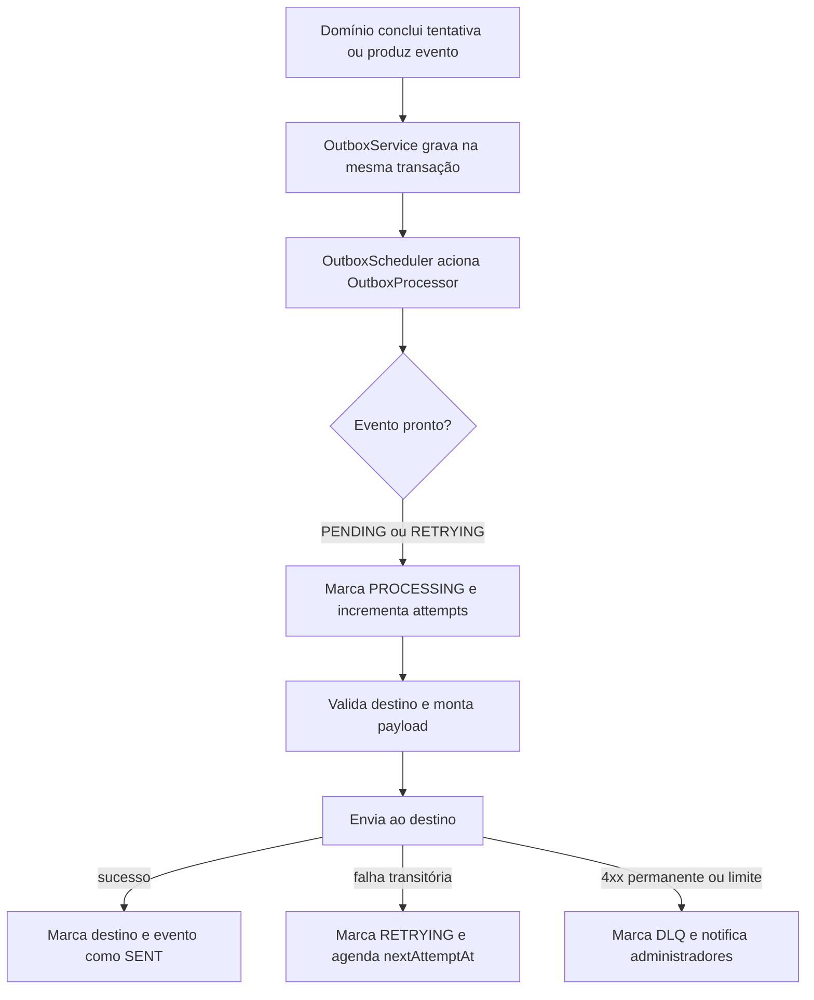

# Arquitetura de Outbox e integração ATS

> **Propósito:** documentar exclusivamente a persistência e a entrega assíncrona de eventos externos. O contrato Gupy está em [Integração Praxis como provedor](INTEGRACAO-GUPY-PROVEDOR.md).

## Estado atual

- A integração ATS operacional é a Gupy.
- Não existe registry genérico de ATS nem adapter abstrato sem provedor real.
- A fila usa `outbox_events`, `OutboxService`, `OutboxProcessor` e `OutboxScheduler`.
- O monitoramento administrativo usa `/api/v1/gupy/result-deliveries`.
- Eventos antigos de confirmação de callback continuam processáveis por compatibilidade, mas novas conclusões não criam um segundo `GET` servidor-servidor.

## Fluxo



Eventos em `PROCESSING` há mais de cinco minutos podem ser reivindicados novamente.

## Eventos processados

| Evento | Uso |
| --- | --- |
| `RESULT_READY` | Envia `TestResultResponse` para `result_webhook_url` e, quando configurado, para a API própria. |
| `ATTEMPT_STARTED` | Envia evento de início para webhook de engajamento configurado. |
| `ATTEMPT_ABANDONED` | Envia evento de abandono para webhook de engajamento configurado. |
| `GUPY_CALLBACK_CONFIRMATION` | Compatibilidade com registros históricos; não é criado pelo fluxo atual de conclusão. |

## Estados do Outbox

| Estado | Significado |
| --- | --- |
| `PENDING` | Aguardando a primeira tentativa. |
| `PROCESSING` | Reivindicado por um processador. |
| `RETRYING` | Falhou de forma transitória e possui nova data em `nextAttemptAt`. |
| `SENT` | Todos os destinos aplicáveis foram entregues. |
| `DLQ` | Falha permanente ou limite de tentativas atingido. |

Cada destino também mantém estado próprio em `deliveryState`, evitando reenviar um destino já confirmado quando outro destino falha.

## Lote e recuperação

- lote máximo: 100 eventos;
- máximo: 5 tentativas;
- evento `PROCESSING` preso: recuperável após 5 minutos;
- processamento e finalização usam transações curtas;
- reprocessamento manual não altera eventos já `SENT`.

## Backoff

| Tentativa executada | Próximo atraso |
| --- | --- |
| 1 | 1 segundo |
| 2 | 4 segundos |
| 3 | 16 segundos |
| 4 | 64 segundos |
| 5 | DLQ |

O valor de 256 segundos existe como fallback interno, mas não é alcançado pelo fluxo normal porque a quinta tentativa encerra em DLQ.

## Classificação das falhas

### Falha permanente

Respostas HTTP `4xx` vão diretamente para DLQ, exceto:

- `408 Request Timeout`;
- `429 Too Many Requests`.

Essas duas respostas são transitórias e seguem o backoff.

### Falha transitória

Entram em retry até o limite:

- `408` e `429`;
- respostas `5xx`;
- falha de rede, DNS ou timeout;
- erro inesperado de processamento;
- URL inválida ou falha de validação que não seja classificada como resposta HTTP `4xx`.

Ao entrar em DLQ, `ResultDeliveryDlqAlertService` cria uma notificação interna para os administradores da empresa.

## Componentes

| Classe | Responsabilidade |
| --- | --- |
| `OutboxEventEntity` | Evento persistido, estado, tentativas, timestamps e estados por destino. |
| `OutboxService` | Criação transacional dos eventos. |
| `OutboxProcessor` | Reivindicação, despacho, retry, DLQ e recuperação. |
| `OutboxScheduler` | Processamento periódico. |
| `ResultWebhookClient` | Contrato de envio HTTP para a Gupy. |
| `RestClientResultWebhookClient` | Implementação HTTP concreta. |
| `GupyOutboundUrlValidator` | Política de URL e proteção contra SSRF. |
| `OutboxResultDeliveryService` | Consulta e reprocessamento administrativo. |
| `ResultDeliveryDlqAlertService` | Notificação de falha definitiva. |

## Monitoramento e operação

```text
GET  /api/v1/gupy/result-deliveries
GET  /api/v1/gupy/result-deliveries/ready
POST /api/v1/gupy/result-deliveries/process-ready
POST /api/v1/gupy/result-deliveries/{deliveryId}/reprocess
```

Filtros:

- `status=pending|processing|retrying|sent|dlq`;
- `simulationId`;
- `versionNumber`.

O reprocessamento se aplica às entregas assíncronas. Ele não repete o redirecionamento de navegador para `callback_url`.

## Regra para novas integrações

Antes de adicionar outro provedor ATS, devem existir:

1. contrato real de entrada e saída;
2. autenticação e isolamento por empresa;
3. payloads de sucesso e erro;
4. política de timeout, retry e DLQ;
5. testes de contrato ou servidor HTTP controlado;
6. observabilidade e procedimento de reprocessamento;
7. documento próprio de homologação.

Não criar abstração de provedor antes de existir uma segunda implementação concreta.

Última revisão: 18/07/2026.
