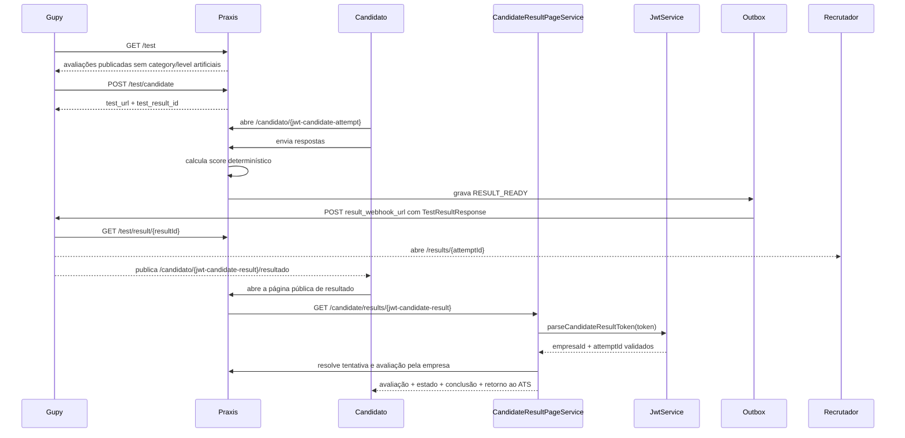
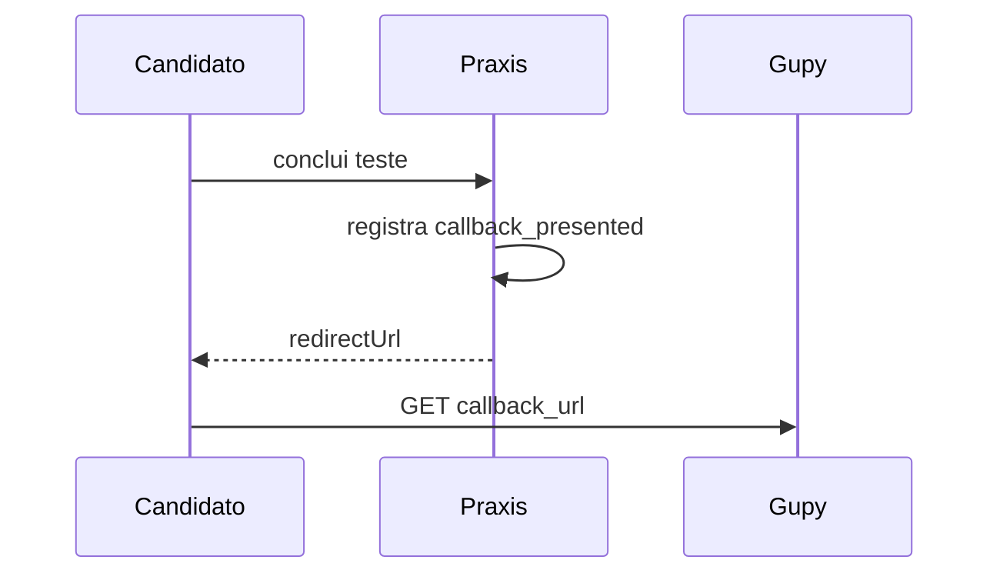

# Integração Praxis como provedor de testes da Gupy

> **Propósito:** documentar o comportamento realmente implementado e comparar esse comportamento com o contrato oficial de provedores externos da Gupy.
>
> **Estado em 15/07/2026:** o catálogo, a criação de tentativa, a consulta de resultado, a URL pública assinada da pessoa candidata e a entrega assíncrona estão implementados. A compatibilidade técnica descrita neste documento não equivale a homologação: o fluxo completo ainda precisa ser validado em uma vaga real da Gupy, incluindo callback e `result_webhook_url` reais.

Fonte oficial usada na revisão:

- https://developers.gupy.io/docs/integra%C3%A7%C3%A3o-com-testes-de-provedores-externos

## Resumo executivo

O Praxis expõe:

- `GET /test` para listar avaliações publicadas;
- `POST /test/candidate` para criar ou reutilizar uma tentativa;
- `GET /test/result/{resultId}` para consultar o resultado;
- entrega assíncrona para `result_webhook_url` por outbox.

O fluxo recebe `callback_url`, `job_id`, `result_webhook_url`, `company_id` e `document_id`, valida o contrato de entrada, preserva pertencimento ao token e mantém identidade idempotente canônica. Consulta e webhook usam o mesmo DTO externo de resultado.

`result_candidate_page_url` é formada com um JWT assinado exclusivo do tipo `candidate_result`, contendo empresa e tentativa, com validade própria definida por `praxis.candidate-result-ttl-hours` — 720 horas por padrão. A página pública consome essa credencial por `CandidateResultPageService.findByToken()`, sem reutilizar o token de execução da avaliação.

## Compatibilidade com o contrato oficial

| Item do contrato Gupy | Implementação atual | Estado |
| --- | --- | --- |
| Bearer token no cabeçalho `Authorization` | Validado por `IntegrationAuthService` contra `integration_tokens` | Compatível |
| `GET /test` com `searchString`, `offset` e `limit` | Implementado; `limit` é normalizado entre 1 e 400 | Compatível |
| Resposta `TestItems` com `limit`, `offset`, `total_tests` e `payload` | Implementada | Compatível |
| Campos opcionais `category` e `level` | O mapper mantém ambos nulos e a serialização `NON_NULL` os omite, pois o domínio publicado não possui fonte configurável para esses metadados | Compatível por omissão de campos opcionais |
| `POST /test/candidate` | Implementado com validação do contrato antes do fluxo | Compatível |
| `name`, `email`, `document_id`, `test_id`, `company_id` | `document_id` e `company_id` são recebidos como inteiros JSON `int64` positivos | Compatível |
| `callback_url` obrigatório | Recebido, validado por política de esquema e host, persistido e reapresentado após conclusão | Implementado; homologação real pendente |
| `job_id` | Recebido e persistido; também participa da idempotência quando informado | Compatível |
| `candidate_type` | Enum estrito: `internal`, `external`, ausência ou JSON `null` | Compatível |
| `previous_result` | Enum estrito: `fail`, ausência ou JSON `null`; `pass`, `none`, a string `"null"` e valores desconhecidos são rejeitados | Compatível |
| `result_webhook_url` | Recebido como `URI`; resultado é enviado por POST | Implementado; comunicação real pendente |
| Resposta `201` com `test_result_id` e `test_url` | Implementada | Compatível |
| `GET /test/result/{resultId}` somente com `resultId` | Implementado sem query adicional; empresa resolvida pelo token | Compatível |
| Callback GET após conclusão | O backend registra que o callback foi disponibilizado e o frontend navega para a URL; a participação concluída continua reapresentando a mesma URL para recuperação | Implementado; homologação real pendente |
| Payload `TestResult` | O DTO externo contém somente os campos do schema oficial publicado | Compatível para estados representáveis |
| Status `notStarted`, `paused`, `done` | `NOT_STARTED`, `IN_PROGRESS` e `COMPLETED` são mapeados; `ABANDONED` e `EXPIRED` são rejeitados | Compatível somente para estados representáveis |
| Resultado numérico de 0 a 100 | Implementado por competência quando a tentativa está concluída | Compatível |
| `result_page_url` para recrutador | Aponta para `/results/{attemptId}`, página autenticada | Compatível |
| `result_candidate_page_url` para candidato | Aponta para `/candidato/{token}/resultado`; o token é um JWT `candidate_result` assinado, contém empresa e tentativa e usa TTL próprio configurável, com padrão de 720 horas | Compatível tecnicamente; homologação real pendente |
| Campos adicionais de confiabilidade | `reliabilityLevel` permanece interno; `other_informations` é serializado somente em `TestResultItem`, onde o schema permite | Compatível |

Os estados acima descrevem apenas o comportamento comprovado em código. Eles não equivalem a homologação com a Gupy.

## Autenticação real

Todas as rotas `/test/**` exigem:

```text
Authorization: Bearer <token>
```

Fluxo:

1. `IntegrationAuthService` calcula o SHA-256 do token recebido.
2. O hash é codificado em Base64URL sem padding.
3. O hash precisa existir na tabela `integration_tokens` para o provider `gupy`.
4. A empresa e o `company_id` são resolvidos a partir desse registro.

O token é gerado pela Central de Integrações. O valor em claro é retornado uma única vez; somente o hash é persistido.

O `company_id` cadastrado para a empresa integrada à Gupy deve conter a representação decimal positiva do identificador `int64` informado pela Gupy. O endpoint converte o inteiro recebido para essa forma canônica antes de validar o pertencimento ao token.

`PRAXIS_INTEGRATION_TOKEN` não é usado por `/test/**` e não é exigido pelo runtime. Cada integração autentica com o token cadastrado para a empresa e o provedor na tabela `integration_tokens`.

## Contrato implementado

### `GET /test`

```text
GET /test?searchString=<texto>&offset=0&limit=50
Authorization: Bearer <token>
```

Regras:

- `searchString`: opcional;
- `offset`: padrão `0`, valores negativos viram `0`;
- `limit`: padrão `50`, normalizado entre `1` e `400`;
- somente avaliações publicadas da empresa do token são retornadas;
- `category` e `level` são omitidos enquanto não existir fonte real configurável no domínio.

Exemplo do payload atualmente produzido:

```json
{
  "limit": 50,
  "offset": 0,
  "total_tests": 1,
  "payload": [
    {
      "id": "sim-atendimento",
      "name": "Atendimento em situação crítica",
      "description": "Avaliação comportamental determinística."
    }
  ]
}
```

### `POST /test/candidate`

Body aceito:

```json
{
  "company_id": 1,
  "document_id": 4398157034,
  "test_id": "sim-atendimento",
  "name": "Candidato Teste",
  "email": "candidato@example.com",
  "job_id": 100,
  "callback_url": "https://empresa.gupy.io/candidate-return",
  "result_webhook_url": "https://empresa.gupy.io/webhook",
  "accommodation_time_multiplier": 1.5,
  "candidate_type": "external",
  "previous_result": null
}
```

Campos:

| Campo | Obrigatório no código | Observação |
| --- | --- | --- |
| `company_id` | Sim | Inteiro JSON `int64` positivo. A forma decimal canônica deve ser igual ao `company_id` associado ao token. Strings, zero, negativos e valores fora de `int64` são rejeitados antes do fluxo. |
| `document_id` | Sim | Inteiro JSON `int64` positivo. A forma decimal canônica participa da chave idempotente. |
| `test_id` | Sim | Deve identificar avaliação publicada da mesma empresa. |
| `name` | Sim | Nome da pessoa candidata. |
| `email` | Sim | Validado como e-mail. |
| `job_id` | Não | Identificador da vaga; quando informado, diferencia a chave idempotente. |
| `callback_url` | Sim | URL absoluta. Em produção, exige HTTPS e host autorizado pela política Gupy; HTTP é permitido somente em perfil local para loopback. Credenciais e fragmentos são rejeitados. |
| `result_webhook_url` | Não | Se presente, recebe `TestResult` por POST. |
| `accommodation_time_multiplier` | Não | Extensão própria para acessibilidade. |
| `candidate_type` | Não | Aceita somente `internal`, `external`, ausência ou JSON `null`. |
| `previous_result` | Não | Aceita `fail`, ausência ou JSON `null`; não aceita `none`, `pass`, a string `"null"` ou outro texto. |

A desserialização estrita e a Bean Validation rejeitam identificadores em formato incorreto, ausentes, não positivos ou fora da faixa de `long`, além de enums desconhecidos, antes de `CandidateAttemptService.createOrReuse()` iniciar a resolução da simulação ou a persistência.

O fluxo compartilhado com a Recrutei mantém o contrato textual próprio desse provedor por meio de um construtor interno explícito. Esse caminho não participa da desserialização do endpoint Gupy e não altera o tipo público de `company_id` ou `document_id`.

Após a conclusão, a API pública devolve `redirectUrl`. O backend registra que o handoff foi disponibilizado e consultas posteriores da participação concluída reapresentam a mesma URL. O navegador continua responsável por efetuar o GET final na `callback_url`.

Resposta:

```json
{
  "test_url": "https://app.exemplo.com/candidato/<jwt-de-execucao>",
  "test_result_id": "res_123"
}
```

A idempotência usa o hash de:

```text
empresaId | companyId decimal canônico | documentId decimal canônico | testId | jobId (quando informado)
```

Como os identificadores são desserializados como `Long` e convertidos uma única vez com `Long.toString`, chamadas equivalentes não produzem identidades distintas por espaços, sinal positivo, zeros à esquerda ou outra representação textual. Chamadas repetidas com a mesma combinação reutilizam a tentativa existente; vagas diferentes continuam produzindo tentativas distintas.

### `GET /test/result/{resultId}`

```text
GET /test/result/res_123
Authorization: Bearer <token>
```

O backend valida:

- Bearer token;
- empresa e `company_id` associados ao token;
- propriedade do resultado pela empresa autenticada;
- existência do resultado;
- estado externamente representável.

O endpoint não recebe parâmetros de query. O isolamento permanece garantido pelo token, pelo `empresaId` e pelo `companyId` resolvidos em `integration_tokens`.

## Resultado produzido

O mesmo `TestResultResponse` é usado pelo `GET /test/result/{resultId}` e pelo POST para `result_webhook_url`:

```json
{
  "title": "Nome da avaliação",
  "testCode": "sim-atendimento",
  "description": "Descrição da avaliação",
  "providerName": "Praxis",
  "company_result_string": "Resultado em Markdown para o RH",
  "providerLink": "https://app.exemplo.com",
  "status": "done",
  "result_page_url": "https://app.exemplo.com/results/att_123",
  "result_candidate_page_url": "https://app.exemplo.com/candidato/<jwt-candidate-result>/resultado",
  "results": [
    {
      "score": 73,
      "result_string": "73%",
      "type_result": "percentage",
      "tier": "major",
      "title": "Comunicação",
      "description": "Pontuação da competência Comunicação.",
      "date": "2026-07-12T12:00:00Z",
      "other_informations": {}
    }
  ]
}
```

`GupyTestResultMapper.candidateResultPageUrl()` gera o token apresentado em `result_candidate_page_url` chamando `JwtService.generateCandidateResultToken(empresaId, attemptId, candidateResultTtlHours)`. O token assinado possui tipo `candidate_result`, empresa, tentativa, emissão e expiração; sua validade é independente dos TTLs usados pelo link e pela sessão de execução.

Ao abrir a URL, o frontend usa o segmento como credencial e consulta `/candidate/results/{token}`. `CandidateResultPageService.findByToken()` chama `JwtService.parseCandidateResultToken()`: o parser verifica assinatura e expiração, exige o tipo `candidate_result` e valida a presença de empresa e tentativa. Em seguida, o serviço consulta a tentativa pelo par `empresaId` e `attemptId`, impedindo que o identificador seja usado fora da empresa registrada no token.

O token de execução e o token de resultado não são intercambiáveis:

- `test_url` usa uma credencial `candidate_attempt`, destinada à execução da avaliação;
- `result_candidate_page_url` usa uma credencial `candidate_result`, destinada somente à consulta da página final.

`reliabilityLevel` e as métricas agregadas de timeout continuam no domínio interno da tentativa e não são serializados no contrato externo. `other_informations` permanece disponível dentro de cada `TestResultItem`, conforme o schema oficial.

Eventos antigos do outbox que ainda contenham extensões de topo continuam processáveis: a desserialização ignora propriedades desconhecidas e o novo envio é normalizado para o DTO oficial.

`result_page_url` abre a página autenticada do recrutador. A rota pública da pessoa candidata é alcançável com a credencial `candidate_result` e expõe somente avaliação, estado, indicador de conclusão, data de término e retorno permitido ao ATS, sem pontuação, respostas, e-mail ou regras internas.

### Mapeamento de estados

| Estado interno | Status Gupy | Comportamento externo |
| --- | --- | --- |
| `NOT_STARTED` | `notStarted` | Representável; lista `results` vazia. |
| `IN_PROGRESS` | `paused` | Representável; lista `results` vazia. |
| `COMPLETED` | `done` | Representável; publica as pontuações finais. |
| `ABANDONED` | Nenhum | Rejeitado por `assertExternallyRepresentable()`; não produz `TestResult`. |
| `EXPIRED` | Nenhum | Rejeitado por `assertExternallyRepresentable()`; não produz `TestResult`. |

Não existe conversão de `ABANDONED` ou `EXPIRED` para `done`.

## Fluxo atual



Fluxo de callback e redirecionamento:



## Outbox e entrega assíncrona

Estados:

- `pending`;
- `processing`;
- `retrying`;
- `sent`;
- `dlq`.

Backoff:

| Tentativa | Próxima tentativa |
| --- | --- |
| 1 | 1 segundo |
| 2 | 4 segundos |
| 3 | 16 segundos |
| 4 | 64 segundos |
| 5 | DLQ |

Tratamento de erro:

- HTTP 4xx vai para DLQ imediatamente, exceto `408` e `429`;
- `408`, `429`, erros 5xx, rede, DNS e falhas transitórias entram em retry;
- após cinco tentativas, o evento vai para DLQ;
- o processamento reivindica lotes de até 100 eventos;
- eventos presos em `PROCESSING` por mais de cinco minutos podem ser retomados.

Monitoramento:

```text
GET  /api/v1/gupy/result-deliveries
GET  /api/v1/gupy/result-deliveries/ready
POST /api/v1/gupy/result-deliveries/process-ready
POST /api/v1/gupy/result-deliveries/{deliveryId}/reprocess
```

## Pendências e bloqueadores externos

1. Executar o fluxo completo em vaga real, pois a documentação da Gupy informa que não há ambiente de sandbox para provedores externos.
2. Validar o POST para uma `result_webhook_url` real da Gupy e confirmar o callback e o redirecionamento na plataforma real.

## Checklist de validação

- [ ] Gerar token Gupy pela Central de Integrações.
- [ ] Validar `GET /test` em ambiente integrado.
- [x] Confirmar que o catálogo omite `category` e `level` sem fonte real.
- [x] Validar paginação e busca em testes automatizados.
- [x] Validar tipos, faixa e enums do payload oficial de `POST /test/candidate` em testes automatizados.
- [x] Confirmar idempotência e diferenciação por `job_id` em testes automatizados.
- [ ] Confirmar `test_url` em ambiente integrado.
- [ ] Concluir uma tentativa em vaga real.
- [x] Validar política de callback e registro do handoff em testes automatizados.
- [ ] Confirmar callback e redirecionamento na plataforma real da Gupy.
- [x] Validar `GET /test/result/{resultId}` sem parâmetros extras e com isolamento pelo token.
- [x] Validar que consulta e webhook não serializam extensões fora do schema oficial.
- [x] Confirmar que `ABANDONED` e `EXPIRED` não são publicados como `done`.
- [x] Confirmar que `result_candidate_page_url` usa JWT `candidate_result`, TTL próprio e consumo por `CandidateResultPageService`.
- [ ] Testar `result_webhook_url` contra uma URL real da Gupy.
- [x] Testar retry, `408`, `429`, 4xx permanente e DLQ em testes automatizados; falta validar a comunicação real.
- [ ] Homologar com cliente e vaga real na Gupy.

Última revisão: 15/07/2026.
