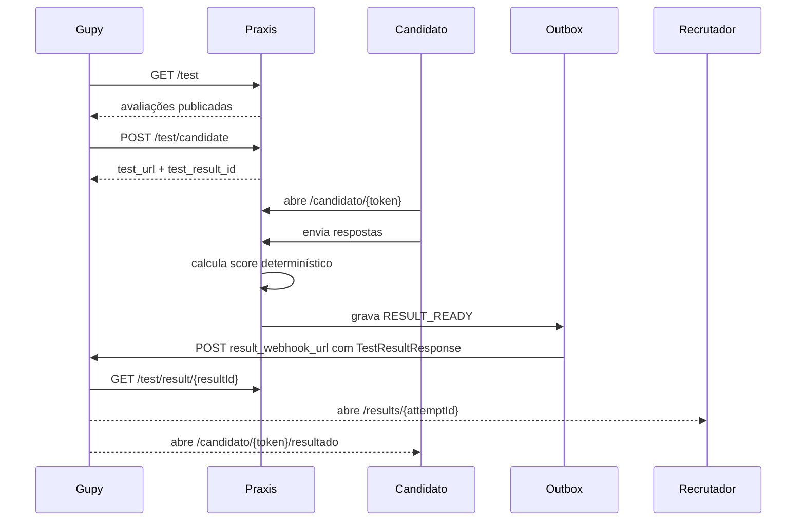
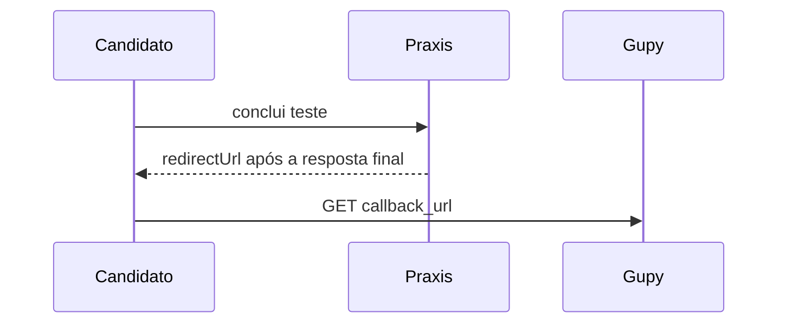

# Integração Praxis como provedor de testes da Gupy

> **Propósito:** documentar o comportamento realmente implementado e comparar esse comportamento com o contrato oficial de provedores externos da Gupy.
>
> **Estado em 15/07/2026:** implementação técnica parcial. Os endpoints principais existem, mas a integração **não está pronta para ser declarada homologada** enquanto as incompatibilidades desta página não forem corrigidas e validadas em uma vaga real da Gupy.
> **Estado em 15/07/2026:** implementação técnica parcial. Os endpoints principais existem e o contrato externo de resultado está alinhado ao schema publicado, mas a integração **não está pronta para ser declarada homologada** enquanto as incompatibilidades restantes não forem corrigidas e validadas em uma vaga real da Gupy.

Fonte oficial usada na revisão:

- https://developers.gupy.io/docs/integra%C3%A7%C3%A3o-com-testes-de-provedores-externos

## Resumo executivo

O Praxis expõe:

- `GET /test` para listar avaliações publicadas;
- `POST /test/candidate` para criar ou reutilizar uma tentativa;
- `GET /test/result/{resultId}` para consultar o resultado;
- entrega assíncrona para `result_webhook_url` por outbox.

O fluxo interno implementa `callback_url`, `job_id`, retorno assíncrono, redirecionamento final, consulta oficial do resultado e páginas web reais para recrutador e candidato. Permanecem divergências de tipos e campos extras no resultado que ainda impedem declarar a integração homologada.
O fluxo interno implementa `callback_url`, `job_id`, retorno assíncrono, redirecionamento final, consulta oficial do resultado e páginas web reais para recrutador e candidato. O mesmo DTO homologado é usado no endpoint de consulta e no webhook. Permanecem divergências de tipos e enums na criação da tentativa que ainda impedem declarar a integração homologada.

## Compatibilidade com o contrato oficial

| Item do contrato Gupy | Implementação atual | Estado |
| --- | --- | --- |
| Bearer token no cabeçalho `Authorization` | Validado por `IntegrationAuthService` contra `integration_tokens` | Compatível |
| `GET /test` com `searchString`, `offset` e `limit` | Implementado; `limit` é normalizado entre 1 e 400 | Compatível |
| Resposta `TestItems` com `limit`, `offset`, `total_tests` e `payload` | Implementada | Compatível |
| `POST /test/candidate` | Implementado | Parcial |
| `name`, `email`, `document_id`, `test_id`, `company_id` | Recebidos | Parcial: `document_id` e `company_id` são `String`, enquanto o contrato oficial os descreve como `int64` |
| `callback_url` obrigatório | Recebido, validado, persistido e devolvido ao navegador após conclusão | Compatível tecnicamente |
| `job_id` | Recebido e persistido; também participa da idempotência quando informado | Compatível |
| `candidate_type` | Desserializado como enum estrito; aceita somente `internal`, `external` ou ausência | Compatível |
| `previous_result` | Desserializado como enum estrito; aceita somente `fail` ou ausência/JSON `null`; `pass`, `none` e textos desconhecidos são rejeitados | Compatível |
| `result_webhook_url` | Recebido como `URI`; resultado é enviado por POST | Compatível |
| Resposta `201` com `test_result_id` e `test_url` | Implementada | Compatível |
| `GET /test/result/{resultId}` somente com `resultId` | Implementado sem query adicional; empresa resolvida pelo token | Compatível |
| Callback GET após conclusão | O frontend navega para `callback_url`, fazendo o GET no navegador da pessoa candidata | Compatível tecnicamente |
| Redirecionamento do candidato de volta à Gupy | Executado automaticamente após a resposta final | Compatível tecnicamente |
| Payload `TestResult` | O DTO externo contém somente os campos do schema oficial publicado | Compatível |
| Status `notStarted`, `paused`, `done` | Implementado | Compatível |
| Resultado numérico de 0 a 100 | Implementado por competência | Compatível |
| `result_page_url` para recrutador | Aponta para `/results/{attemptId}`, página autenticada com competências, respostas e decisão humana | Compatível |
| `result_candidate_page_url` para candidato | Aponta para `/candidato/{token}/resultado`, página assinada e limitada a status, avaliação e retorno ao ATS | Compatível |
| Campos adicionais de confiabilidade | `reliabilityLevel` permanece interno; `other_informations` é serializado apenas em `TestResultItem`, onde o schema oficial permite | Compatível |

## Autenticação real

Todas as rotas `/test/**` exigem:

```text
Authorization: Bearer <token>
```

Fluxo:

1. `IntegrationAuthService` calcula o SHA-256 do token recebido.
2. O hash é codificado em Base64URL sem padding.
3. O hash precisa existir na tabela `integration_tokens` para o provider `gupy`.
4. A empresa e o `company_id` são resolvidos a partir desse registro.

O token é gerado pela Central de Integrações, usando os endpoints internos de integração. O valor em claro é retornado uma única vez; somente o hash é persistido.

`PRAXIS_INTEGRATION_TOKEN` não é usado por `/test/**` e não é exigido pelo runtime. O `docker-compose.yml` reflete o modelo efetivo: cada integração autentica com o token cadastrado para a empresa e o provedor na tabela `integration_tokens`.

## Contrato implementado

### `GET /test`

```text
GET /test?searchString=<texto>&offset=0&limit=50
Authorization: Bearer <token>
```

Regras:

- `searchString`: opcional;
- `offset`: padrão `0`, valores negativos viram `0`;
- `limit`: padrão `50`, normalizado entre `1` e `400`;
- somente avaliações publicadas da empresa do token são retornadas.

Exemplo:

```json
{
  "limit": 50,
  "offset": 0,
  "total_tests": 1,
  "payload": [
    {
      "id": "sim-atendimento",
      "name": "Atendimento em situação crítica",
      "category": "Situational Judgment",
      "description": "Avaliação comportamental determinística.",
      "level": "advanced"
    }
  ]
}
```

### `POST /test/candidate`

Body atualmente aceito:

```json
{
  "company_id": "empresa-123",
  "document_id": "candidate-document-456",
  "test_id": "sim-atendimento",
  "name": "Candidato Teste",
  "email": "candidato@example.com",
  "job_id": 100,
  "callback_url": "https://integracao.gupy.example/candidate-return",
  "result_webhook_url": "https://integracao.gupy.example/webhook",
  "accommodation_time_multiplier": 1.5,
  "candidate_type": "external",
  "previous_result": null
}
```

Campos atuais:

| Campo | Obrigatório no código | Observação |
| --- | --- | --- |
| `company_id` | Sim | Deve ser igual ao `company_id` associado ao token. |
| `document_id` | Sim | Participa da chave idempotente. |
| `test_id` | Sim | Deve identificar avaliação publicada da mesma empresa. |
| `name` | Sim | Nome da pessoa candidata. |
| `email` | Sim | Validado como e-mail. |
| `job_id` | Não | Identificador da vaga; quando informado, diferencia a chave idempotente. |
| `callback_url` | Sim | URL absoluta HTTP(S), persistida para o retorno final à Gupy. |
| `result_webhook_url` | Não | Se presente, recebe `TestResult` por POST. |
| `accommodation_time_multiplier` | Não | Extensão própria para acessibilidade. |
| `candidate_type` | Não | Enum estrito: aceita `internal`, `external` ou ausência; qualquer outro texto retorna `400`. |
| `previous_result` | Não | Enum estrito: aceita `fail` ou ausência/JSON `null`; não converte ausência em `none` e rejeita a string `"null"`. |

Após a conclusão, a API pública devolve `redirectUrl` à tela. O frontend navega diretamente para a `callback_url` recebida da Gupy, fazendo o GET final no navegador da pessoa candidata.

Resposta:

```json
{
  "test_url": "https://app.exemplo.com/candidato/<token-publico-da-tentativa>",
  "test_result_id": "res_123"
}
```

A idempotência usa o hash de:

```text
empresaId | companyId | documentId | testId | jobId (quando informado)
```

Chamadas repetidas com a mesma combinação reutilizam a tentativa existente.

### `GET /test/result/{resultId}`

Implementação atual:

```text
GET /test/result/res_123
Authorization: Bearer <token>
```

O backend valida:

- Bearer token;
- empresa e `company_id` associados ao token;
- propriedade do resultado pela empresa autenticada;
- existência do resultado.

O endpoint não recebe parâmetros de query. O isolamento permanece garantido pelo token, pelo `empresaId` e pelo `companyId` resolvidos em `integration_tokens`.

## Resultado produzido

O mesmo `TestResultResponse` é usado pelo `GET /test/result/{resultId}` e pelo POST para `result_webhook_url`:

```json
{
  "title": "Nome da avaliação",
  "testCode": "sim-atendimento",
  "description": "Descrição da avaliação",
  "providerName": "Praxis",
  "company_result_string": "Resultado em Markdown para o RH",
  "providerLink": "https://app.exemplo.com",
  "status": "done",
  "result_page_url": "https://app.exemplo.com/results/att_123",
  "result_candidate_page_url": "https://app.exemplo.com/candidato/<token-assinado>/resultado",
  "results": [
    {
      "score": 73,
      "result_string": "73%",
      "type_result": "percentage",
      "tier": "major",
      "title": "Comunicação",
      "description": "Pontuação da competência Comunicação.",
      "date": "2026-07-12T12:00:00Z",
      "other_informations": {}
    }
  ]
}
```

`reliabilityLevel` e as métricas agregadas de timeout continuam no domínio interno da tentativa e não são serializados no contrato externo. O campo `other_informations` permanece disponível dentro de cada `TestResultItem`, conforme o schema oficial.

Eventos antigos do outbox que ainda contenham as extensões de topo continuam processáveis: a desserialização ignora propriedades desconhecidas e o novo envio é normalizado para o DTO oficial.

`result_page_url` abre a página autenticada do recrutador. `result_candidate_page_url` usa token assinado e abre uma página separada que não expõe pontuação, respostas, e-mail ou regras internas; ela mostra apenas o estado da participação, a avaliação e o retorno ao processo seletivo.

Mapeamento de status:

| Estado interno | Status Gupy |
| --- | --- |
| `NOT_STARTED` | `notStarted` |
| `IN_PROGRESS` | `paused` |
| `COMPLETED` | `done` |
| `ABANDONED` | `done` |
| `EXPIRED` | `done` |

## Fluxo atual



Fluxo de callback e redirecionamento implementado:



## Outbox e entrega assíncrona

Estados:

- `pending`;
- `processing`;
- `retrying`;
- `sent`;
- `dlq`.

Backoff:

| Tentativa | Próxima tentativa |
| --- | --- |
| 1 | 1 segundo |
| 2 | 4 segundos |
| 3 | 16 segundos |
| 4 | 64 segundos |
| 5 | DLQ |

Tratamento de erro:

- HTTP 4xx vai para DLQ imediatamente, exceto `408` e `429`;
- `408`, `429`, erros 5xx, rede, DNS e falhas transitórias entram em retry;
- após cinco tentativas, o evento vai para DLQ;
- o processamento reivindica lotes de até 100 eventos;
- eventos presos em `PROCESSING` por mais de cinco minutos podem ser retomados.

Monitoramento:

```text
GET  /api/v1/gupy/result-deliveries
GET  /api/v1/gupy/result-deliveries/ready
POST /api/v1/gupy/result-deliveries/process-ready
POST /api/v1/gupy/result-deliveries/{deliveryId}/reprocess
```

## Bloqueadores para homologação

1. Definir compatibilidade de tipos para `company_id` e `document_id`.
2. Validar com a Gupy se campos extras no `TestResult` são aceitos ou removê-los do contrato externo.
2. Aceitar e validar `previous_result` conforme `fail` ou `null`.
3. Executar homologação em vaga real, pois a própria documentação da Gupy informa que não há ambiente de sandbox para esse fluxo.

## Checklist de validação

- [ ] Gerar token Gupy pela Central de Integrações.
- [ ] Validar `GET /test`.
- [ ] Validar paginação e busca.
- [ ] Validar o payload oficial completo de `POST /test/candidate`.
- [x] Validar `candidate_type` e `previous_result`, incluindo rejeição de valores desconhecidos e preservação de ausência como JSON `null`.
- [ ] Confirmar idempotência.
- [ ] Confirmar `test_url` na página `/candidato/{token}`.
- [ ] Concluir uma tentativa.
- [x] Validar callback e redirecionamento em testes automatizados; falta confirmar na homologação real da Gupy.
- [x] Validar `GET /test/result/{resultId}` sem parâmetros extras e com isolamento pelo token.
- [x] Validar que o endpoint de consulta não serializa extensões fora do schema oficial.
- [x] Validar que o payload do webhook usa o mesmo DTO oficial e normaliza eventos legados do outbox.
- [x] Validar páginas reais do `TestResult` para recrutador e candidato, incluindo isolamento de dados.
- [ ] Testar `result_webhook_url` contra uma URL real da Gupy.
- [ ] Testar retry, `408`, `429`, 4xx permanente e DLQ em homologação integrada.
- [ ] Homologar com cliente e vaga real na Gupy.

Última revisão: 15/07/2026.
