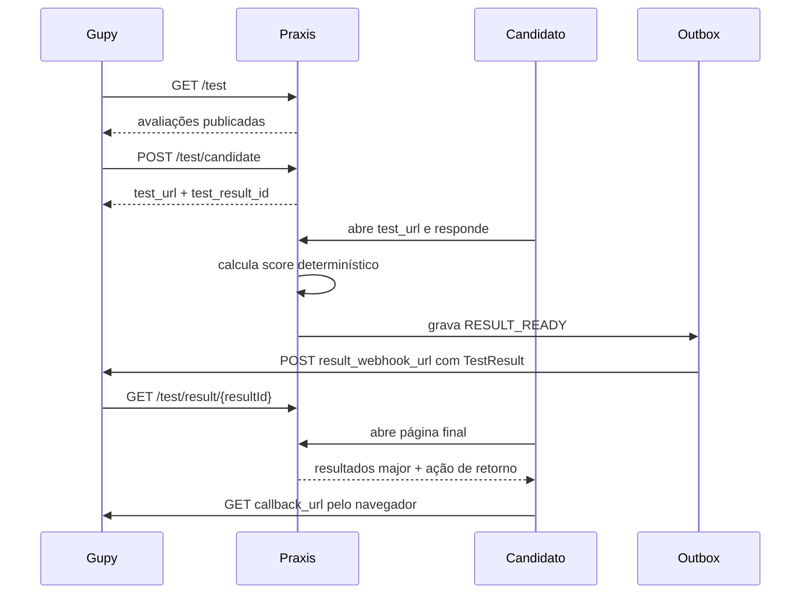

# Integração Praxis como provedor de testes da Gupy

> **Propósito:** documentar o comportamento realmente implementado e comparar esse comportamento com o contrato oficial de provedores externos da Gupy.
>
> **Estado em 16/07/2026:** catálogo, criação de tentativa, consulta de resultado, página pública assinada da pessoa candidata e entrega assíncrona do resultado estão implementados. Compatibilidade técnica não equivale a homologação: o fluxo ainda precisa ser validado em uma vaga real da Gupy.

Fonte oficial usada na revisão:

- https://developers.gupy.io/docs/integra%C3%A7%C3%A3o-com-testes-de-provedores-externos

## Resumo executivo

O Praxis expõe:

- `GET /test` para listar avaliações publicadas;
- `POST /test/candidate` para criar ou reutilizar uma tentativa;
- `GET /test/result/{resultId}` para consultar o resultado;
- POST assíncrono do `TestResult` para `result_webhook_url` por outbox;
- página pública de resultado protegida por JWT específico da pessoa candidata.

O fluxo recebe `callback_url`, `job_id`, `result_webhook_url`, `company_id` e `document_id`, valida o contrato, preserva o pertencimento ao token e usa identidade idempotente canônica. Consulta e webhook usam o mesmo DTO externo de resultado.

`result_candidate_page_url` usa um JWT assinado do tipo `candidate_result`, contendo empresa e tentativa, com validade definida por `praxis.candidate-result-ttl-hours`, 720 horas por padrão. O token de resultado não é reutilizado para executar a avaliação.

## Compatibilidade com o contrato oficial

| Item do contrato Gupy | Implementação atual | Estado |
| --- | --- | --- |
| Bearer token no cabeçalho `Authorization` | Validado por `IntegrationAuthService` contra `integration_tokens` | Compatível |
| `GET /test` com `searchString`, `offset` e `limit` | Implementado; `offset` mínimo 0 e `limit` entre 0 e 400 | Compatível |
| Resposta `TestItems` com `limit`, `offset`, `total_tests` e `payload` | Implementada | Compatível |
| `limit=0` | Retorna `payload` vazio e preserva `total_tests` sem consultar os itens | Compatível |
| Campos opcionais `category` e `level` | Omitidos enquanto não houver fonte real configurável no domínio | Compatível por omissão |
| `POST /test/candidate` | Implementado com validação antes do fluxo | Compatível |
| `company_id` e `document_id` | Inteiros JSON `int64` positivos | Compatível |
| `callback_url` obrigatório | Persistido e devolvido ao navegador após a conclusão para redirecionamento | Implementado; homologação real pendente |
| `job_id` | Persistido e incluído na idempotência quando informado | Compatível |
| `candidate_type` | Aceita `internal`, `external`, ausência ou JSON `null` | Compatível |
| `previous_result` | Aceita `fail`, ausência, JSON `null` e a string `"null"` usada no exemplo oficial | Compatível |
| `result_webhook_url` | Recebido como `URI`; recebe `TestResult` por POST | Implementado; comunicação real pendente |
| Resposta `201` com `test_result_id` e `test_url` | Implementada | Compatível |
| `GET /test/result/{resultId}` | Implementado sem query adicional; empresa resolvida pelo token | Compatível |
| Callback GET após conclusão | O navegador da pessoa candidata navega para `callback_url`; não há segundo GET servidor-servidor | Compatível com o handoff por redirecionamento; homologação real pendente |
| Payload `TestResult` | Contém somente os campos do schema publicado | Compatível para estados representáveis |
| Status `notStarted`, `paused`, `done` | `NOT_STARTED`, `IN_PROGRESS` e `COMPLETED` são mapeados | Compatível |
| `ABANDONED` e `EXPIRED` | Não são convertidos artificialmente em `done` | Compatível por rejeição |
| Resultado numérico de 0 a 100 | Produzido por competência em tentativa concluída | Compatível |
| `result_page_url` | Aponta para `/results/{attemptId}`, página autenticada do RH | Compatível |
| `result_candidate_page_url` | Aponta para `/candidato/{token}/resultado` com JWT `candidate_result` | Compatível tecnicamente |
| Resultado múltiplo para candidato | A página pública mostra somente itens `major` | Compatível |
| Campos internos de confiabilidade | Não são serializados no topo do contrato externo | Compatível |

Os estados acima descrevem somente comportamento comprovado em código. Eles não representam homologação comercial ou técnica pela Gupy.

## Autenticação

Todas as rotas `/test/**` exigem:

```text
Authorization: Bearer <token>
```

Fluxo:

1. `IntegrationAuthService` calcula o SHA-256 do token recebido.
2. O hash é codificado em Base64URL sem padding.
3. O hash precisa existir em `integration_tokens` para o provider `gupy`.
4. Empresa e `company_id` são resolvidos a partir desse registro.

O token é gerado pela Central de Integrações. O valor em claro é retornado uma única vez; somente o hash é persistido.

O `company_id` associado à integração deve ser a representação decimal positiva do identificador `int64` informado pela Gupy. `PRAXIS_INTEGRATION_TOKEN` não é usado por `/test/**`.

## Contrato implementado

### `GET /test`

```text
GET /test?searchString=<texto>&offset=0&limit=50
Authorization: Bearer <token>
```

Regras:

- `searchString`: opcional;
- `offset`: padrão `0`; valores negativos viram `0`;
- `limit`: padrão `50`; normalizado entre `0` e `400`;
- `limit=0`: retorna página vazia com o total disponível;
- somente avaliações publicadas da empresa do token são retornadas;
- `category` e `level` são omitidos sem uma fonte configurável real.

Exemplo:

```json
{
  "limit": 50,
  "offset": 0,
  "total_tests": 1,
  "payload": [
    {
      "id": "sim-atendimento",
      "name": "Atendimento em situação crítica",
      "description": "Avaliação comportamental determinística."
    }
  ]
}
```

### `POST /test/candidate`

```json
{
  "company_id": 1,
  "document_id": 4398157034,
  "test_id": "sim-atendimento",
  "name": "Candidato Teste",
  "email": "candidato@example.com",
  "job_id": 100,
  "callback_url": "https://empresa.gupy.io/candidate-return",
  "result_webhook_url": "https://empresa.gupy.io/webhook",
  "accommodation_time_multiplier": 1.5,
  "candidate_type": "external",
  "previous_result": "null"
}
```

| Campo | Obrigatório | Regra |
| --- | --- | --- |
| `company_id` | Sim | Inteiro JSON `int64` positivo e pertencente ao token. |
| `document_id` | Sim | Inteiro JSON `int64` positivo; participa da idempotência. |
| `test_id` | Sim | Avaliação publicada da mesma empresa. |
| `name` | Sim | Nome da pessoa candidata. |
| `email` | Sim | E-mail válido. |
| `job_id` | Não | Diferencia a chave idempotente quando informado. |
| `callback_url` | Sim | URL absoluta, sem credenciais ou fragmento; HTTPS em produção. |
| `result_webhook_url` | Não | Destino exclusivo do `TestResult`. |
| `accommodation_time_multiplier` | Não | Extensão própria para acessibilidade. |
| `candidate_type` | Não | `internal`, `external`, ausência ou JSON `null`. |
| `previous_result` | Não | `fail`, ausência, JSON `null` ou string `"null"`. |

Identificadores inválidos, ausentes, não positivos ou fora de `long`, além de enums desconhecidos, são rejeitados antes da persistência. A string `"null"` de `previous_result` é normalizada para ausência de resultado anterior.

Resposta:

```json
{
  "test_url": "https://app.exemplo.com/candidato/<jwt-candidate-attempt>",
  "test_result_id": "res_123"
}
```

A idempotência usa o hash de:

```text
empresaId | companyId canônico | documentId canônico | testId | jobId quando informado | ciclo inicial ou reteste
```

`previous_result=fail` representa o ciclo contratual de reteste e exige tentativa anterior em estado terminal.

### `GET /test/result/{resultId}`

```text
GET /test/result/res_123
Authorization: Bearer <token>
```

O backend valida token, empresa, `company_id`, propriedade do resultado, existência e estado externamente representável.

## Resultado produzido

O mesmo `TestResultResponse` é usado na consulta e no POST para `result_webhook_url`:

```json
{
  "title": "Nome da avaliação",
  "testCode": "sim-atendimento",
  "description": "Descrição da avaliação",
  "providerName": "Praxis",
  "company_result_string": "Resultado em Markdown para o RH",
  "providerLink": "https://app.exemplo.com",
  "status": "done",
  "result_page_url": "https://app.exemplo.com/results/att_123",
  "result_candidate_page_url": "https://app.exemplo.com/candidato/<jwt-candidate-result>/resultado",
  "results": [
    {
      "score": 73,
      "result_string": "73%",
      "type_result": "percentage",
      "tier": "major",
      "title": "Comunicação",
      "description": "Pontuação da competência Comunicação.",
      "date": "2026-07-12T12:00:00Z",
      "other_informations": {}
    }
  ]
}
```

A página pública da pessoa candidata:

- exige token `candidate_result` válido;
- consulta a tentativa pelo par empresa e tentativa;
- mostra somente resultados `major` após conclusão;
- não expõe e-mail, respostas, pesos, alternativas, regras internas ou métricas de confiabilidade;
- reapresenta o `callback_url` como ação de retorno ao processo seletivo.

### Mapeamento de estados

| Estado interno | Status Gupy | Resultado externo |
| --- | --- | --- |
| `NOT_STARTED` | `notStarted` | `results` vazio. |
| `IN_PROGRESS` | `paused` | `results` vazio. |
| `COMPLETED` | `done` | Pontuações finais. |
| `ABANDONED` | Sem equivalente | Não produz `TestResult`. |
| `EXPIRED` | Sem equivalente | Não produz `TestResult`. |

## Fluxo atual



## Callback e histórico legado

`callback_url` é tratado como destino de redirecionamento da pessoa candidata. A tentativa concluída reapresenta a mesma URL para recuperação quando a navegação anterior foi interrompida.

Uma implementação antiga também disparava um GET servidor-servidor. Esse comportamento foi desativado porque duplicava o GET executado pelo navegador. A migração `V1005__disable_duplicate_gupy_callback_confirmation.sql` removeu o trigger e enviou eventos pendentes para DLQ.

O endpoint abaixo permanece somente para consulta de registros históricos:

```text
GET /api/v1/gupy/callback-deliveries
```

Não existe reprocessamento manual de callback. O antigo `POST /api/v1/gupy/callback-deliveries/{deliveryId}/reprocess` foi removido para impedir reativação acidental do fluxo duplicado.

## Outbox de resultado

Estados:

- `pending`;
- `processing`;
- `retrying`;
- `sent`;
- `dlq`.

Backoff:

| Tentativa | Próxima tentativa |
| --- | --- |
| 1 | 1 segundo |
| 2 | 4 segundos |
| 3 | 16 segundos |
| 4 | 64 segundos |
| 5 | DLQ |

Regras:

- HTTP 4xx vai para DLQ imediatamente, exceto `408` e `429`;
- `408`, `429`, 5xx, rede, DNS e falhas transitórias entram em retry;
- após cinco tentativas, o evento vai para DLQ;
- lotes possuem até 100 eventos;
- eventos presos em `PROCESSING` por mais de cinco minutos podem ser retomados.

Monitoramento:

```text
GET  /api/v1/gupy/result-deliveries
GET  /api/v1/gupy/result-deliveries/ready
POST /api/v1/gupy/result-deliveries/process-ready
POST /api/v1/gupy/result-deliveries/{deliveryId}/reprocess
```

## Pendências externas

1. Executar o fluxo completo em vaga real, pois a Gupy não oferece sandbox para provedores externos.
2. Validar o POST para uma `result_webhook_url` real.
3. Confirmar o redirecionamento do navegador por `callback_url` na plataforma real.
4. Homologar a integração com cliente e vaga reais.

## Checklist de validação

- [ ] Gerar token Gupy pela Central de Integrações.
- [ ] Validar `GET /test` em ambiente integrado.
- [x] Validar paginação, busca e `limit=0` em testes automatizados.
- [x] Confirmar omissão de `category` e `level` sem fonte real.
- [x] Validar tipos, faixa e enums de `POST /test/candidate`.
- [x] Aceitar JSON `null` e string `"null"` em `previous_result`.
- [x] Confirmar idempotência, diferenciação por `job_id` e reteste por `fail`.
- [ ] Confirmar `test_url` em ambiente integrado.
- [ ] Concluir uma tentativa em vaga real.
- [x] Validar que o callback é reapresentado ao navegador.
- [x] Remover o reprocessamento servidor-servidor duplicado.
- [ ] Confirmar o redirecionamento para `callback_url` em vaga real.
- [x] Validar isolamento de `GET /test/result/{resultId}`.
- [x] Validar que consulta e webhook não serializam extensões no topo.
- [x] Confirmar que `ABANDONED` e `EXPIRED` não são publicados como `done`.
- [x] Confirmar JWT específico para `result_candidate_page_url`.
- [x] Exibir somente resultados `major` à pessoa candidata.
- [ ] Testar `result_webhook_url` contra URL real da Gupy.
- [x] Testar retry, `408`, `429`, 4xx permanente e DLQ.
- [ ] Homologar com cliente e vaga real na Gupy.

Última revisão: 16/07/2026.
