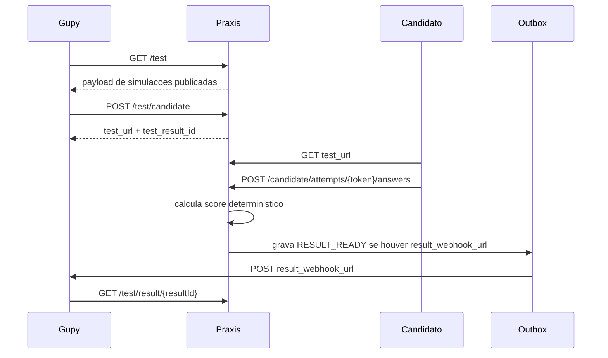

# Integracao Praxis como Provedor de Testes da Gupy

> **Proposito:** documentar o contrato real implementado para a Gupy consumir o Praxis como provedor externo de testes.
> **Status:** alinhado ao backend em 20/06/2026.

## Visao geral

O Praxis expoe tres endpoints publicos para a Gupy:

- listar simulacoes publicadas;
- criar ou reutilizar uma tentativa de candidato;
- consultar o resultado final.

Quando a tentativa tem `result_webhook_url`, o resultado tambem e entregue de forma assincrona pelo outbox.

## Autenticacao

Todas as rotas `/test/**` exigem:

```text
Authorization: Bearer <token>
```

O backend nao valida esse token diretamente por uma variavel `PRAXIS_INTEGRATION_TOKEN`. O fluxo atual e:

1. `GupyAuthService` calcula SHA-256 do token recebido.
2. O hash e codificado em Base64URL sem padding.
3. O hash precisa existir em `tenants.integration_token_hash`.
4. O tenant e o `company_id` sao resolvidos a partir desse registro.

Para configurar localmente:

```bash
node -e "const crypto=require('crypto'); console.log(crypto.createHash('sha256').update('token-local').digest('base64url'))"
```

```sql
UPDATE tenants
SET integration_token_hash = '<hash-gerado>'
WHERE id = 'tenant-1';
```

## Endpoints

| Metodo | Endpoint | Descricao |
| --- | --- | --- |
| `GET` | `/test` | Lista simulacoes publicadas do tenant do token. |
| `POST` | `/test/candidate` | Cria ou reutiliza tentativa idempotente. |
| `GET` | `/test/result/{resultId}?company_id={companyId}` | Consulta resultado final escopado por empresa. |

## `GET /test`

Query params:

- `searchString` opcional.
- `offset` opcional; padrao `0`.
- `limit` opcional; padrao `50`, normalizado entre `1` e `400`.

Resposta real:

```json
{
  "limit": 50,
  "offset": 0,
  "total_tests": 1,
  "payload": [
    {
      "id": "sim-atendimento",
      "name": "Atendimento em situacao critica",
      "category": "Situational Judgment",
      "description": "Avaliacao comportamental deterministica.",
      "level": "advanced"
    }
  ]
}
```

## `POST /test/candidate`

Body real em snake_case:

```json
{
  "company_id": "empresa-123",
  "document_id": "candidate-document-456",
  "test_id": "sim-atendimento",
  "name": "Candidato Teste",
  "email": "candidato@example.com",
  "result_webhook_url": "https://integracao.gupy.example/webhook",
  "accommodation_time_multiplier": 1.5,
  "candidate_type": "external",
  "previous_result": "none"
}
```

Campos:

| Campo | Obrigatorio | Observacao |
| --- | --- | --- |
| `company_id` | Sim | Deve bater com a empresa associada ao token. |
| `document_id` | Sim | Usado na chave idempotente. |
| `test_id` | Sim | ID da simulacao publicada. |
| `name` | Sim | Nome do candidato. |
| `email` | Sim | Email valido do candidato. |
| `result_webhook_url` | Nao | Se informado, recebe resultado/eventos por outbox. |
| `accommodation_time_multiplier` | Nao | Multiplicador de tempo para acessibilidade. |
| `candidate_type` | Nao | Exemplo: `internal` ou `external`. |
| `previous_result` | Nao | Exemplo: `pass`, `fail` ou `none`. |

Nao existem no DTO atual:

- `candidatePhone`;
- campo de callback de retorno;
- campos em camelCase para empresa, documento, candidato ou webhook.

Resposta real:

```json
{
  "test_url": "http://localhost:8080/candidate/attempts/<token-publico-da-tentativa>",
  "test_result_id": "res_123"
}
```

Observacao operacional: no backend atual, `test_url` e montada com `PRAXIS_PUBLIC_BASE_URL + /candidate/attempts/{token}`. Esse endpoint retorna JSON da tentativa. Se a Gupy precisar abrir uma experiencia de browser para o candidato, o produto deve ajustar o backend/configuracao para devolver URL de frontend em `/candidato/{token}` ou usar `PRAXIS_CANDIDATE_PAGE_BASE_URL` em outro ponto do fluxo.

## `GET /test/result/{resultId}`

Exemplo:

```text
GET /test/result/res_123?company_id=empresa-123
Authorization: Bearer <token>
```

O backend valida:

- Bearer token;
- tenant associado ao hash do token;
- `company_id` compativel com o tenant;
- existencia do resultado.

## Fluxo atual



## Entrega assincrona por outbox

Status:

- `pending`
- `retrying`
- `sent`
- `dlq`

Backoff:

| Tentativa | Proximo retry |
| --- | --- |
| 1 | 1 segundo |
| 2 | 4 segundos |
| 3 | 16 segundos |
| 4 | 64 segundos |
| 5+ | DLQ |

Nuance de erro:

- Erros HTTP 4xx vindos do destino sao tratados como erro de contrato e vao para DLQ.
- Erros de rede, DNS, URL invalida, parsing ou falha inesperada podem entrar em retry ate o limite.

## Monitoramento interno

```text
GET  /api/v1/gupy/result-deliveries
GET  /api/v1/gupy/result-deliveries/ready
POST /api/v1/gupy/result-deliveries/process-ready
POST /api/v1/gupy/result-deliveries/{deliveryId}/reprocess
```

Filtros de listagem:

- `status=pending|retrying|sent|dlq`
- `simulationId`
- `versionNumber`

## Fora do contrato atual

Nao documentar como implementado:

- redirect final de volta para a Gupy;
- chamada de callback de retorno ao finalizar teste;
- payload camelCase;
- variavel antiga de API key da Gupy;
- endpoint separado de ativacao Gupy;
- preflight contra sandbox/vaga real da Gupy.

## Checklist de homologacao

- [ ] Definir URL publica real do backend.
- [ ] Configurar hash do token em `tenants.integration_token_hash`.
- [ ] Validar `GET /test` com `total_tests` e `payload`.
- [ ] Validar `POST /test/candidate` com body snake_case.
- [ ] Verificar se `test_url` atende a expectativa da Gupy para browser/API.
- [ ] Completar uma tentativa.
- [ ] Validar `GET /test/result/{resultId}?company_id=...`.
- [ ] Testar `result_webhook_url` com sucesso.
- [ ] Testar retry e DLQ.

Ultima revisao: 20/06/2026.
