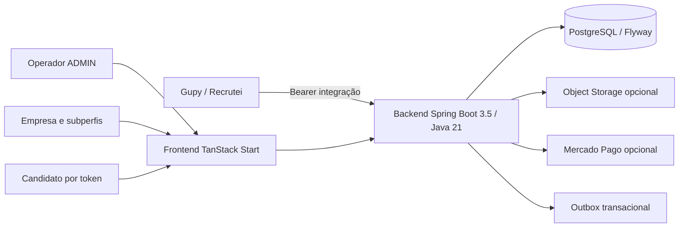

# Documentação Operacional — Práxis

> **Propósito:** descrever como o Práxis funciona em produção para que administradores, suporte,
> DevOps, operação e manutenção consigam operar o sistema sem depender de conhecimento informal.
>
> **Escopo:** Parte A da documentação operacional e de implantação. A instalação do zero está em
> [IMPLANTACAO.md](IMPLANTACAO.md).
>
> **Regra de sincronização:** mudanças que alterem operação, segurança, configuração, runtime ou
> implantação devem atualizar esta documentação na mesma entrega.

Esta revisão foi conferida contra a `main` no commit
`1f6ff281210e6aa71b1880da1119d22f8aabb68e`, incluindo código Java, propriedades, Dockerfiles e
migrações Flyway.

---

## 2. Arquitetura geral

### 2.1 Visão geral

O Práxis é uma plataforma multiempresa de avaliação comportamental determinística. A empresa cria
simulações situacionais, publica versões imutáveis e aplica avaliações por link interno ou integração
com ATS. O score é calculado por alternativa, competência e peso; não há IA julgando candidatos.



### 2.2 Principais módulos

| Módulo | Responsabilidade |
| --- | --- |
| `auth` | Login, JWT, convites, recuperação de senha, empresa e papéis. |
| `account` | Conta do usuário autenticado e troca de senha. |
| `admin` | Governança da plataforma, empresas, usuários, uso e auditoria. |
| `billing` | Cobrança Mercado Pago, webhook, ledger e planos. |
| `simulation` | Criação, versões, grafo, validação, publicação, monitoramento e Talent Match. |
| `candidate` | Fluxo público do candidato e links internos. |
| `gupy` | Contrato externo `/test/**`. |
| `recrutei` | Contrato externo `/recrutei/test/**`. |
| `companyprofile` | Perfil da empresa. |
| `empresaconfig` | Catálogos configuráveis por empresa. |
| `media` | Upload de imagem e áudio para nós e alternativas. |
| `term` | Aceite de termos. |
| `audit` | Trilha append-only. |
| `shared.outbox` | Entrega assíncrona com retry e DLQ. |

### 2.3 Fluxo de requisições

1. O frontend SSR, um cliente HTTP ou o ATS chama o backend na raiz `/`.
2. `JwtAuthenticationFilter` resolve autenticação, empresa e autoridades.
3. `SecurityConfig` aplica rota pública, papel principal e subperfil exigido.
4. O contexto de empresa isola os dados.
5. Escritas relevantes geram auditoria; entregas externas usam outbox.

### 2.4 Autenticação e rotas públicas

- `POST /api/v1/auth/login`: autenticação de usuários internos e emissão de JWT.
- `POST /api/v1/auth/invite/accept`: aceite de convite e criação de senha.
- `POST /api/v1/auth/password/forgot`: solicita recuperação de senha sem revelar se o e-mail existe.
- `POST /api/v1/auth/password/reset`: redefine a senha com token temporário válido.
- `/candidate/**`: acesso por token de tentativa, sem usuário interno.
- `/test/**` e `/recrutei/test/**`: Bearer token de integração comparado por SHA-256 Base64URL.
- `/api/webhooks/mercado-pago/**`: público no Spring Security, mas validado por assinatura no handler.
- `/actuator/health`: público para health check.
- Swagger/OpenAPI, quando habilitados, exigem `ADMIN`.

A recuperação de senha usa TTL, limite por janela e token armazenado apenas de forma segura. O link
pode ser enviado por SMTP; logging do link só deve ser usado fora de produção e depende das flags de
fallback de console.

### 2.5 Multiempresa

- Cada cliente é um `EmpresaEntity`.
- A empresa técnica `PLATFORM` hospeda operadores `ADMIN`.
- Com segurança ligada, a empresa vem do JWT ou token de integração.
- Com segurança desligada, usa-se `PRAXIS_DEFAULT_EMPRESA_ID`; essa configuração é proibida em
  produção pelas validações de startup.
- `SUSPENSO` e `CANCELADO` bloqueiam autenticação e APIs protegidas.

### 2.6 Integrações externas

| Integração | Direção | Mecanismo | Padrão |
| --- | --- | --- | --- |
| Gupy | ATS → Práxis | `/test/**` com Bearer de integração | Operacional |
| Recrutei | ATS → Práxis | `/recrutei/test/**` com Bearer de integração | Operacional |
| Webhook de resultado | Práxis → externo | Outbox para `result_webhook_url` | Sob demanda |
| Mercado Pago | Práxis ↔ MP | REST + webhook assinado | Desabilitado por padrão |
| Object Storage | Práxis → S3 | AWS SDK v2 | Opcional |

### 2.7 Armazenamento de mídia

Mídias são enviadas por `POST /api/v1/media`. O Object Storage S3-compatível exige endpoint, URL
pública, região, credenciais e bucket coerentes quando configurado. O perfil `prod` rejeita
configuração parcial. Os limites padrão são 10 MB por arquivo e 12 MB por requisição.

### 2.8 Banco de dados

- PostgreSQL com Flyway habilitado no startup.
- Migrações em `backend/src/main/resources/db/migration` e subdiretórios específicos.
- A sequência atual está acima de `V1000`; não use intervalos fixos em procedimentos operacionais.
- `spring.flyway.out-of-order=false` por padrão e no perfil `prod`.
- `spring.jpa.hibernate.ddl-auto=none` por padrão; use `validate` em produção.

---

## 3. Estrutura dos serviços

### Backend

| Item | Valor |
| --- | --- |
| Stack | Spring Boot 3.5.3, Java 21, Maven |
| Porta | `8080` |
| Context path | Raiz `/` |
| Health | `GET /actuator/health` |
| Info do build | `GET /actuator/info` |
| Swagger UI | `/docs`, opt-in e restrito a `ADMIN` |
| Artefato | `target/praxis-backend-*.jar` |

### Frontend

| Item | Valor |
| --- | --- |
| Stack | React 19, TanStack Start/Router, Vite, Tailwind |
| Desenvolvimento | Vite na porta `5173` |
| Produção | container Node.js 22 na porta `80` |
| Runtime | `node .output/server/index.mjs` |
| Build | `npm ci` e `npm run build` no container |

O frontend não usa Nginx como runtime da imagem atual. Nginx, Traefik ou outro proxy pode existir na
infraestrutura externa para TLS e roteamento.

---

## 4. Configurações

As propriedades ficam em `backend/src/main/resources/application.properties` e podem ser
sobrescritas pelas variáveis de ambiente indicadas.

### 4.1 Núcleo e banco

| Propriedade | Env | Padrão / regra |
| --- | --- | --- |
| `server.port` | `SERVER_PORT` | `8080` |
| `spring.datasource.url` | `DB_HOST`, `DB_PORT`, `DB_NAME`, `DB_SCHEMA` | JDBC PostgreSQL local em desenvolvimento |
| `spring.datasource.username` | `DB_USER` | `postgres` em desenvolvimento |
| `spring.datasource.password` | `DB_PASS` | `postgres` em desenvolvimento |
| `spring.jpa.hibernate.ddl-auto` | `PRAXIS_JPA_DDL_AUTO` | `none`; use `validate` em produção |
| `spring.flyway.out-of-order` | `SPRING_FLYWAY_OUT_OF_ORDER` | `false` |
| `spring.datasource.hikari.maximum-pool-size` | `SPRING_DATASOURCE_HIKARI_MAXIMUM_POOL_SIZE` | `5` |

### 4.2 Plataforma e segurança

| Propriedade | Env | Padrão / regra |
| --- | --- | --- |
| `praxis.public-base-url` | `PRAXIS_PUBLIC_BASE_URL` | localhost em dev; HTTPS obrigatório em prod |
| `praxis.candidate-page-base-url` | `PRAXIS_CANDIDATE_PAGE_BASE_URL` | herda a URL pública |
| `praxis.security.enabled` | `PRAXIS_SECURITY_ENABLED` | `true`; não pode ser `false` em prod |
| `praxis.default-empresa-id` | `PRAXIS_DEFAULT_EMPRESA_ID` | `empresa-1` em dev |
| `praxis.jwt-secret` | `PRAXIS_JWT_SECRET` | obrigatório e forte em prod |
| `praxis.jwt-expiration-hours` | `PRAXIS_JWT_EXPIRATION_HOURS` | `8` |
| `praxis.cors.allowed-origins` | `PRAXIS_CORS_ALLOWED_ORIGINS` | obrigatório, HTTPS e sem wildcard em prod |
| `praxis.partner.enabled` | `PRAXIS_PARTNER_ENABLED` | `false` |

### 4.3 Recuperação de senha e notificações

| Propriedade | Env | Padrão |
| --- | --- | --- |
| `praxis.email.enabled` | `PRAXIS_EMAIL_ENABLED` | `false` |
| `praxis.email.from` | `PRAXIS_EMAIL_FROM` | `no-reply@praxis.local` |
| `praxis.auth.password-reset-ttl-hours` | `PRAXIS_AUTH_PASSWORD_RESET_TTL_HOURS` | `2` |
| `praxis.auth.password-reset-max-attempts` | `PRAXIS_AUTH_PASSWORD_RESET_MAX_ATTEMPTS` | `5` |
| `praxis.auth.password-reset-window-minutes` | `PRAXIS_AUTH_PASSWORD_RESET_WINDOW_MINUTES` | `15` |
| `praxis.auth.password-reset-log-link` | `PRAXIS_AUTH_PASSWORD_RESET_LOG_LINK` | `false` |
| `praxis.notifications.console-fallback-enabled` | `PRAXIS_NOTIFICATIONS_CONSOLE_FALLBACK_ENABLED` | `false` |

Quando e-mail estiver habilitado em produção, SMTP e remetente válido devem estar configurados. O
fallback de console deve permanecer desligado.

### 4.4 LGPD e privacidade

| Propriedade | Env | Padrão / regra |
| --- | --- | --- |
| `praxis.privacy-retention-days` | `PRAXIS_PRIVACY_RETENTION_DAYS` | `180` |
| `praxis.privacy-retention-enabled` | `PRAXIS_PRIVACY_RETENTION_ENABLED` | `true` |
| `praxis.privacy-retention-cron` | `PRAXIS_PRIVACY_RETENTION_CRON` | `0 30 3 * * *` |
| `praxis.privacy.controller-name` | `PRAXIS_PRIVACY_CONTROLLER_NAME` | obrigatório em prod |
| `praxis.privacy.service-email` | `PRAXIS_PRIVACY_SERVICE_EMAIL` | informar e-mail ou URL de atendimento |
| `praxis.privacy.service-url` | `PRAXIS_PRIVACY_SERVICE_URL` | informar URL ou e-mail de atendimento |
| `praxis.privacy.dpo-contact` | `PRAXIS_PRIVACY_DPO_CONTACT` | opcional |

### 4.5 Mercado Pago

`MP_ENABLED=false` por padrão. Quando habilitado, `MP_ACCESS_TOKEN`, `MP_PUBLIC_KEY`,
`MP_WEBHOOK_SECRET`, `MP_NOTIFICATION_URL` HTTPS e demais URLs devem ser consistentes. O perfil
`prod` rejeita configuração incompleta.

### 4.6 Object Storage

Quando qualquer propriedade `OBJECT_STORAGE_*` for informada, endpoint, URL pública, região,
access key, secret key e bucket devem formar uma configuração completa. `path-style=true` suporta
MinIO e provedores compatíveis.

### 4.7 Swagger e Actuator

| Propriedade | Env | Finalidade | Padrão |
| --- | --- | --- | --- |
| `springdoc.swagger-ui.enabled` | `SPRINGDOC_SWAGGER_UI_ENABLED` | Expõe Swagger UI em `/docs` | `false` |
| `springdoc.api-docs.enabled` | `SPRINGDOC_API_DOCS_ENABLED` | Expõe OpenAPI em `/v3/api-docs` | `false` |
| `management.endpoints.web.exposure.include` | `MANAGEMENT_ENDPOINTS_WEB_EXPOSURE_INCLUDE` | Define endpoints Actuator expostos | `health,info` |

Por padrão, `health,info` são expostos via web. `health` é público; a exposição adicional deve ser
avaliada conforme a infraestrutura. Swagger e OpenAPI são opt-in e, quando ativos, exigem `ADMIN`.

### 4.8 Proxies confiáveis

`server.forward-headers-strategy=native` e o `RemoteIpValve` do Tomcat processam cabeçalhos
encaminhados somente quando o peer imediato corresponde a `PRAXIS_TRUSTED_PROXY_REGEX`. Ajuste a
expressão à rede real; não confie diretamente em `X-Forwarded-For` vindo da internet.

---

## 5. Usuários e autorização

O backend possui os papéis principais `ADMIN` e `EMPRESA`. Para usuários de empresa, o
`SecurityConfig` também aplica subperfis por rota e ação:

| Autoridade | Responsabilidade principal |
| --- | --- |
| `TEAM_MANAGER` | Gestão de equipe e operações permitidas ao gestor. |
| `ASSESSMENT_EDITOR` | Autoria e edição de avaliações. |
| `RESULTS_ANALYST` | Consulta e análise de resultados. |
| `OPERATIONS_MANAGER` | Operação de convites, tentativas e entregas. |
| `PARTNER_MANAGER` | Gestão do módulo de parceiros, quando habilitado. |
| `PARTNER_SPECIALIST` | Atuação especializada e restrita no módulo de parceiros. |

A presença de `EMPRESA` não concede automaticamente todas as ações: endpoints sensíveis exigem o
subperfil correspondente. O candidato não é usuário interno e acessa somente por token de tentativa.

### ADMIN

Opera `/api/admin/**`, incluindo cadastro e governança de empresas, usuários, uso, auditoria e
billing. Os operadores ficam na empresa técnica `PLATFORM`.

### EMPRESA e subperfis

As APIs `/api/v1/**` cobrem perfil, configurações, avaliações, candidatos, resultados, auditoria,
integrações e entregas. A autorização concreta depende do endpoint e do subperfil aplicado pelo
`SecurityConfig`.

---

## 6. Fluxos operacionais

### 6.1 Cadastro e convite

1. `ADMIN` cria a empresa.
2. Cria ou convida o responsável.
3. O convite é enviado com token e TTL.
4. O usuário aceita em `POST /api/v1/auth/invite/accept`.
5. Após criar a senha, passa a autenticar em `/api/v1/auth/login`.

### 6.2 Recuperação de senha

1. O usuário informa o e-mail em `POST /api/v1/auth/password/forgot`.
2. O backend aplica limite de tentativas e responde de forma neutra.
3. Um token temporário é enviado pelo canal configurado.
4. A nova senha é registrada em `POST /api/v1/auth/password/reset`.
5. Tokens expirados, usados ou inválidos são rejeitados.

Usuários autenticados continuam podendo trocar a própria senha pelo endpoint de conta.

### 6.3 Avaliação

```text
Rascunho → objetivo/competências → personagens e alternativas → validação → publicação imutável
→ link interno ou ATS → execução do candidato → score determinístico → auditoria e entrega
```

### 6.4 Cobrança

O `ADMIN` inicia checkout. O Mercado Pago confirma por webhook assinado. O backend consulta a API do
provedor antes de aplicar alterações financeiras e registra ledger/auditoria. O módulo é opcional.

### 6.5 Suspensão e cancelamento

`SUSPENSO` bloqueia login e APIs até reativação. `CANCELADO` encerra o acesso ativo e preserva os
dados e a auditoria; não há exclusão física automática nesse fluxo.

---

## 7. Auditoria

Eventos de simulação, tentativa, consentimento, decisões humanas, integrações e ações administrativas
são registrados em `audit_events`. A trilha é append-only: correções geram novos eventos; eventos
existentes não são editados ou excluídos.

Consultas de empresa ficam em `/api/v1/audit/**`; consultas administrativas ficam em
`/api/admin/audit/**`.

---

## 8. Backup

O Práxis não embarca rotina de backup. A infraestrutura deve manter:

- dump lógico periódico do PostgreSQL;
- retenção compatível com LGPD e requisitos do cliente;
- WAL/PITR quando o RPO exigir;
- versionamento e lifecycle do bucket de mídia;
- testes periódicos de restauração em ambiente isolado.

Após restaurar, suba o backend com `PRAXIS_JPA_DDL_AUTO=validate`, confirme Flyway, health check,
login e um fluxo crítico de avaliação.

---

## 9. Logs

O backend usa SLF4J/Logback em stdout. Observe autenticação, billing, webhooks, integrações, outbox e
falhas de configuração. Nunca registre segredos, tokens em claro ou PII desnecessária.

`INFO` representa operação normal; `WARN`, degradação recuperável; `ERROR`, falha que exige ação.

---

## 10. Monitoramento

- `GET /actuator/health`: disponibilidade e dependências.
- `GET /actuator/info`: versão e horário do build quando build-info estiver presente.
- Por padrão, `health,info` são expostos via web.
- Monitore taxa de 5xx, latência, CPU/memória, pool Hikari, locks do banco, profundidade do outbox e DLQ.
- Ajuste recursos da JVM e do Node conforme carga real.

---

## 11. Incidentes

| Cenário | Sintoma | Ação |
| --- | --- | --- |
| Banco indisponível | health `DOWN`, falha no startup | Verificar rede, credenciais, PostgreSQL e Flyway. |
| Configuração inválida em prod | aplicação recusa iniciar | Corrigir a propriedade indicada pelo validador; não contornar a trava. |
| S3 indisponível | upload falha | Revisar `OBJECT_STORAGE_*` e reprocessar o upload. |
| Mercado Pago indisponível | checkout/sync falham | Reprocessar após retorno; webhooks são idempotentes. |
| ATS indisponível | falhas em `/test/**` | Verificar disponibilidade e token de integração. |
| Webhook atrasado | resultado não chega | Acompanhar retry/outbox e reprocessar conforme runbook. |
| Recuperação de senha não envia | usuário não recebe link | Verificar e-mail habilitado, SMTP, remetente e logs sem expor token. |
| IP incorreto no rate limit | origem aparece como proxy | Revisar `PRAXIS_TRUSTED_PROXY_REGEX` e cadeia de proxies. |

---

## 12. Atualizações e rollback

1. Drenar ou retirar a instância do balanceador.
2. Fazer backup do banco e snapshot do storage.
3. Conferir migrations e compatibilidade.
4. Subir a nova versão; Flyway aplica migrations no startup.
5. Validar `/actuator/health`, `/actuator/info`, login e um fluxo crítico.
6. Recolocar a instância em serviço.

Flyway não executa rollback automático. Prefira migrations compatíveis para frente. Quando houver
incompatibilidade, restaure o backup ou aplique migration corretiva antes de retornar a aplicação.

---

## Validação da documentação

Execute:

```bash
python scripts/validate_docs.py
```

A validação confere links e governança Gupy e também detecta divergências verificáveis entre esta
documentação, `application.properties`, `PasswordResetController`, `frontend/Dockerfile` e a política
de versões Flyway.

---

## Referências

- [README principal](../README.md)
- [IMPLANTACAO.md](IMPLANTACAO.md)
- [Integração Gupy](INTEGRACAO-GUPY-PROVEDOR.md)
- [Mercado Pago](mercado-pago.md)
- [Arquitetura Outbox](ARQUITETURA_OUTBOX_PATTERN.md)

**Versão do sistema coberta:** backend `0.1.0-SNAPSHOT`, Spring Boot 3.5.3, Java 21.
**Base revisada:** `main` no commit `1f6ff281210e6aa71b1880da1119d22f8aabb68e`.
**Última revisão:** 23/07/2026.
