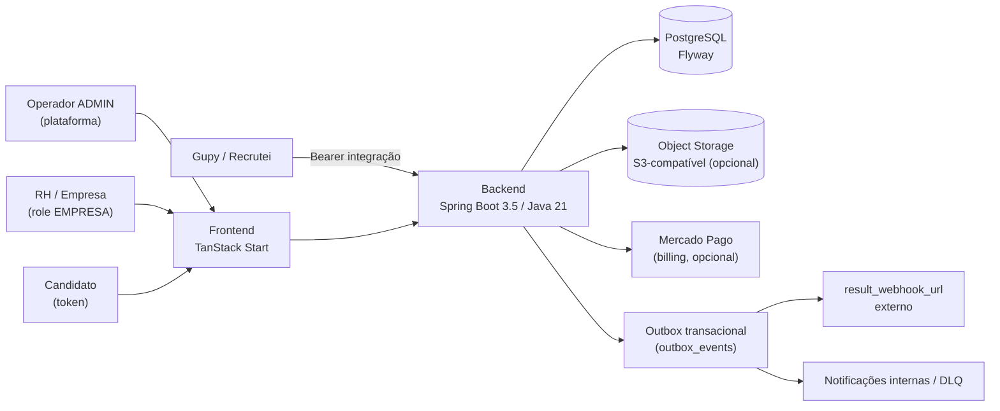
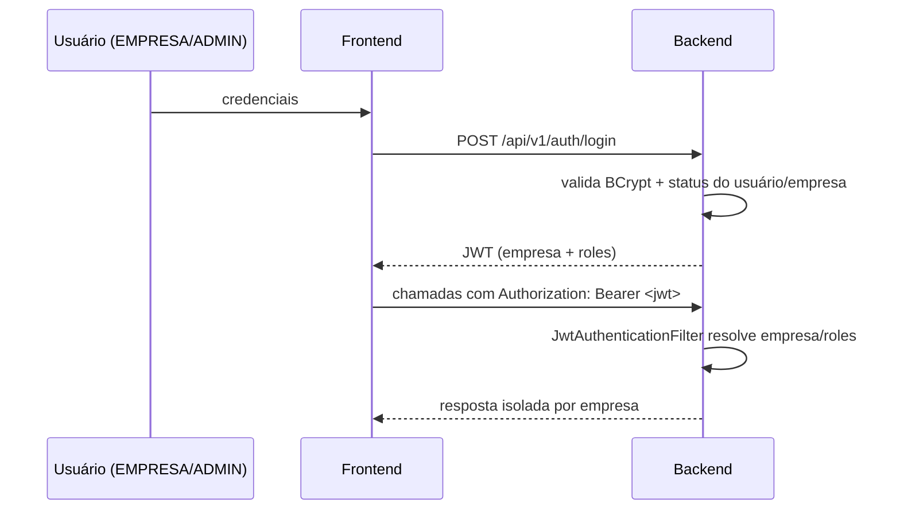
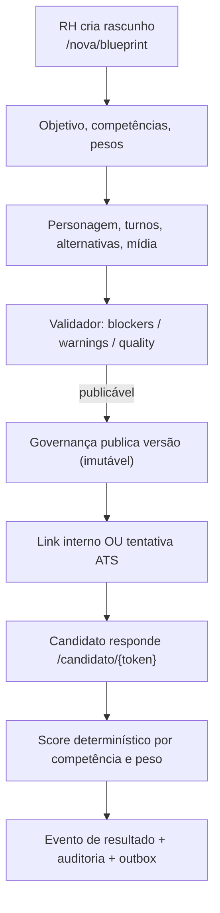
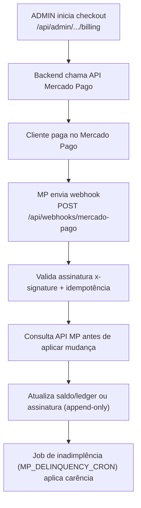

# Documentação Operacional — Práxis

> **Propósito:** descrever como o Práxis funciona em produção para que administradores da
> plataforma, suporte, DevOps, operação e manutenção consigam operar o sistema sem depender de
> conhecimento informal da equipe de desenvolvimento.
>
> **Escopo:** Parte A do requisito de Documentação Operacional e de Implantação. A instalação do
> zero está em [IMPLANTACAO.md](IMPLANTACAO.md).
>
> **Regra de sincronização:** a documentação é parte do produto. Sempre que uma funcionalidade
> alterar a operação ou a implantação, este documento deve ser atualizado na mesma entrega.

Esta documentação é fiel ao código em `backend/src/main/java/br/com/iforce/praxis`, às migrações
em `backend/src/main/resources/db/migration` e a `backend/src/main/resources/application.properties`.

---

## 2. Arquitetura geral

### 2.1 Visão geral

O Práxis é uma plataforma multi-empresa de avaliação comportamental determinística. RH/Empresa cria
simulações situacionais, publica versões imutáveis e aplica em candidatos por link interno ou por
integração com ATS (Gupy, Recrutei). O score é calculado de forma determinística por alternativa
escolhida, competência e peso — não há IA julgando candidato.



### 2.2 Principais módulos

Pacote base `br.com.iforce.praxis`:

| Módulo | Responsabilidade |
| --- | --- |
| `auth` | Login, JWT, empresa e roles. |
| `account` | Conta do próprio usuário (`/me`, troca de senha). |
| `admin` | Painel da plataforma (role `ADMIN`): cadastro e governança de empresas, usuários, uso e auditoria. |
| `billing` | Cobrança Mercado Pago (Parte B); webhook público, ledger e planos. Desligado por padrão. |
| `simulation` | Criação, versões, grafo, validação, publicação, monitoramento e Talent Match. |
| `candidate` | Fluxo público do candidato e links internos. |
| `gupy` | Contrato externo `/test/**` (provedor de testes da Gupy). |
| `recrutei` | Contrato externo `/recrutei/test/**` (provedor de testes da Recrutei). |
| `companyprofile` | Perfil da empresa do empresa. |
| `empresaconfig` | Catálogos configuráveis por empresa. |
| `media` | Upload de imagem/áudio para nós e alternativas (Object Storage). |
| `term` | Aceite de termos. |
| `audit` | Trilha de eventos append-only. |
| `shared.outbox` | Entrega assíncrona de eventos/resultados com retry e DLQ. |

### 2.3 Fluxo de requisições

1. O frontend (SSR/proxy) ou o ATS chama o backend em `http://<host>:8080` (sem context path; raiz `/`).
2. `JwtAuthenticationFilter` resolve autenticação e empresa antes das regras do Spring Security.
3. O `SecurityConfig` decide rota pública × protegida e qual role é exigida.
4. O contexto de empresa isola simulações, tentativas, auditoria, mídia e entregas.
5. Escritas relevantes geram evento de auditoria append-only; resultados externos vão ao outbox.

### 2.4 Autenticação

- **Usuários internos (ADMIN, EMPRESA):** `POST /api/v1/auth/login` retorna JWT (assinado com
  `PRAXIS_JWT_SECRET`, expiração `PRAXIS_JWT_EXPIRATION_HOURS`, padrão 8h). O token carrega empresa e roles.
- **Convite:** `POST /api/v1/auth/invite/accept` cria a senha e ativa o usuário convidado.
- **Candidato:** sem usuário; usa token de tentativa (`attemptToken`) em rotas `/candidate/**`.
- **Integração ATS (`/test/**`, `/recrutei/test/**`):** Bearer token de integração; o backend compara
  o SHA-256 Base64URL do token com `empresas.integration_token_hash` (Gupy) ou o hash da Recrutei.
- **Webhook Mercado Pago (`/api/webhooks/mercado-pago/**`):** público, validado por assinatura
  `x-signature` no próprio handler, sem JWT.



### 2.5 Multi-empresa

- Cada cliente é um `EmpresaEntity` (não existe `CustomerEntity`). Cliente = empresa.
- O empresa técnico `PLATFORM` hospeda os operadores `ADMIN`.
- Com `PRAXIS_SECURITY_ENABLED=true`, o empresa vem do JWT (interno) ou do token de integração (ATS).
- Com `PRAXIS_SECURITY_ENABLED=false`, todas as rotas ficam liberadas e o empresa usado é
  `PRAXIS_DEFAULT_EMPRESA_ID` (padrão `empresa-1`; o nome legado `PRAXIS_DEFAULT_TENANT_ID`
  é aceito como fallback). Se a empresa configurada não existir no banco, ela é criada
  automaticamente no startup. **Use `false` apenas em desenvolvimento.**
- `EmpresaStatus.SUSPENSO` e `CANCELADO` bloqueiam autenticação e APIs protegidas; `SEM_CREDITO` e
  `INADIMPLENTE` não bloqueiam login/API.

### 2.6 Integrações externas

| Integração | Direção | Rota / Mecanismo | Padrão |
| --- | --- | --- | --- |
| Gupy | ATS → Práxis | `GET /test`, `POST /test/candidate`, `GET /test/result/{id}` (Bearer integração) | Operacional |
| Recrutei | ATS → Práxis | `/recrutei/test`, `/recrutei/test/**` (Bearer integração) | Operacional |
| Webhook de resultado | Práxis → externo | Outbox entrega para `result_webhook_url` da tentativa | Sob demanda |
| Mercado Pago | Práxis ↔ MP | API REST + webhook `/api/webhooks/mercado-pago` | `MP_ENABLED=false` por padrão |
| Object Storage (S3) | Práxis → S3 | AWS SDK v2; upload de mídia | Opcional (`OBJECT_STORAGE_*`) |

### 2.7 Armazenamento de arquivos

- Mídia (imagem/áudio) de nós e alternativas é enviada via `POST /api/v1/media`.
- Backend persiste em storage S3-compatível pela AWS SDK v2 quando `OBJECT_STORAGE_*` está configurado.
- `path-style=true` (padrão) suporta MinIO e provedores S3-compatíveis; defina `endpoint`,
  `public-url`, `region`, `access-key`, `secret-key` e `bucket`.
- Limite de upload: `PRAXIS_MEDIA_MAX_FILE_SIZE` (padrão 10MB) e `PRAXIS_MEDIA_MAX_REQUEST_SIZE` (12MB).

### 2.8 Banco de dados

- PostgreSQL com schema versionado por **Flyway** (`spring.flyway.enabled=true`).
- Migrações em `backend/src/main/resources/db/migration` (e `.../postgresql` para SQL específico).
- `spring.jpa.hibernate.ddl-auto` padrão `none`; em produção mantenha `validate` (compose usa `validate`).
  **Nunca** use `update`/`create` em produção: o schema é responsabilidade do Flyway.

### 2.9 Diagrama — fluxo de avaliação



### 2.10 Diagrama — fluxo Mercado Pago



---

## 3. Estrutura dos serviços

### Backend

| Item | Valor |
| --- | --- |
| Stack | Spring Boot 3.5.3, Java 21, Maven |
| Porta | `8080` (`server.port`, override `SERVER_PORT`) |
| Context path | Raiz `/` (não há context path configurado) |
| Health check | `GET /actuator/health` (público) |
| Documentação de API | Swagger UI em `/docs` quando `SPRINGDOC_SWAGGER_UI_ENABLED=true` |
| Artefato | `target/praxis-backend-*.jar` (Spring Boot fat jar) |

### Banco

| Item | Valor |
| --- | --- |
| SGBD | PostgreSQL |
| Versão validada | `postgres:17-alpine` (docker-compose). Recomendado PostgreSQL 14+ |
| Migrações | Flyway, automáticas no startup |

### Storage

| Item | Valor |
| --- | --- |
| Tipo | S3-compatível (AWS S3 ou MinIO), AWS SDK v2 |
| Bucket padrão | `praxis-media` (`OBJECT_STORAGE_BUCKET`) |
| Obrigatório? | Não; só para funcionalidade de mídia |

### Integrações

| Item | Valor |
| --- | --- |
| Mercado Pago | Billing (Parte B), `MP_ENABLED=false` por padrão |
| Gupy | Provedor de testes, rotas `/test/**` |
| Recrutei | Provedor de testes, rotas `/recrutei/test/**` |

### Frontend

| Item | Valor |
| --- | --- |
| Stack | React 19, TanStack Start/Router, Vite, Tailwind |
| Porta | Dev `5173` (Vite); container Nginx `80` |
| Build container | `npm ci`; dev local com `pnpm` |

---

## 4. Configurações

Propriedades em `application.properties` (sobrescritas pelas variáveis de ambiente entre `${...}`).
Para cada uma: finalidade, se é obrigatória, valor padrão e exemplo.

### 4.1 Núcleo da aplicação e banco

| Propriedade | Env | Finalidade | Obrigatória | Padrão | Exemplo |
| --- | --- | --- | --- | --- | --- |
| `server.port` | `SERVER_PORT` | Porta HTTP do backend | Não | `8080` | `8080` |
| `spring.datasource.url` | `DB_HOST`,`DB_PORT`,`DB_NAME`,`DB_SCHEMA` | Conexão JDBC PostgreSQL | Sim (em prod) | `jdbc:postgresql://localhost:5432/postgres?currentSchema=public` | host `db`, porta `5432`, nome `praxis` |
| `spring.datasource.username` | `DB_USER` | Usuário do banco | Sim | `postgres` | `praxis` |
| `spring.datasource.password` | `DB_PASS` (ou `SPRING_DATASOURCE_PASSWORD`) | Senha do banco | Sim | `postgres` | `senha-forte` |
| `spring.jpa.hibernate.ddl-auto` | `PRAXIS_JPA_DDL_AUTO` | Estratégia DDL do Hibernate | Não | `none` | `validate` (prod) |
| `spring.datasource.hikari.maximum-pool-size` | `SPRING_DATASOURCE_HIKARI_MAXIMUM_POOL_SIZE` | Pool de conexões | Não | `5` | `10` |

### 4.2 Plataforma Práxis

| Propriedade | Env | Finalidade | Obrigatória | Padrão | Exemplo |
| --- | --- | --- | --- | --- | --- |
| `praxis.public-base-url` | `PRAXIS_PUBLIC_BASE_URL` | Base pública usada em links e resultados | Sim (prod) | `http://localhost:8080` | `https://app.praxis.com.br` |
| `praxis.candidate-page-base-url` | `PRAXIS_CANDIDATE_PAGE_BASE_URL` | Base pública do fluxo do candidato | Não | herda `public-base-url` | `https://app.praxis.com.br` |
| `praxis.security.enabled` | `PRAXIS_SECURITY_ENABLED` | Liga/desliga segurança interna (JWT) | Não | `true` | `true` |
| `praxis.default-empresa-id` | `PRAXIS_DEFAULT_EMPRESA_ID` (fallback legado: `PRAXIS_DEFAULT_TENANT_ID`) | Empresa usado quando segurança está desligada (criada no startup se não existir) | Não | `empresa-1` | `empresa-1` |
| `praxis.jwt-secret` | `PRAXIS_JWT_SECRET` | Segredo de assinatura do JWT | Sim | — (sem padrão) | string longa e aleatória |
| `praxis.jwt-expiration-hours` | `PRAXIS_JWT_EXPIRATION_HOURS` | Validade do JWT em horas | Não | `8` | `8` |
| `praxis.cors.allowed-origins` | `PRAXIS_CORS_ALLOWED_ORIGINS` | Origens liberadas no CORS (lista por vírgula) | Não | localhost dev | `https://app.praxis.com.br` |
| `praxis.attempt-link-ttl-hours` | `PRAXIS_ATTEMPT_LINK_TTL_HOURS` | TTL do link de tentativa | Não | `168` | `168` |
| `praxis.attempt-session-ttl-hours` | `PRAXIS_ATTEMPT_SESSION_TTL_HOURS` | TTL da sessão da tentativa | Não | `24` | `24` |
| `praxis.recommend-interview-threshold` | `PRAXIS_RECOMMEND_INTERVIEW_THRESHOLD` | Score mínimo para recomendar entrevista | Não | `70` | `70` |

### 4.3 Operador ADMIN e convites

> O requisito cita `praxis.admin.invite-ttl-hours`, `praxis.admin.bootstrap.email` e
> `praxis.admin.bootstrap.password`. Elas existem no código (`@Value`), não no `application.properties`.

| Propriedade | Env | Finalidade | Obrigatória | Padrão | Exemplo |
| --- | --- | --- | --- | --- | --- |
| `praxis.admin.invite-ttl-hours` | `PRAXIS_ADMIN_INVITE_TTL_HOURS` | TTL do convite emitido pelo ADMIN | Não | `168` | `72` |
| `praxis.admin.bootstrap.email` | `PRAXIS_ADMIN_BOOTSTRAP_EMAIL` | E-mail do operador ADMIN inicial (empresa PLATFORM) | Não (recomendado no 1º deploy) | vazio | `admin@praxis.com.br` |
| `praxis.admin.bootstrap.password` | `PRAXIS_ADMIN_BOOTSTRAP_PASSWORD` | Senha do operador ADMIN inicial | Não (par com email) | vazio | senha forte |
| `praxis.admin.bootstrap.name` | `PRAXIS_ADMIN_BOOTSTRAP_NAME` | Nome do operador ADMIN inicial | Não | `Operador da plataforma` | `Operação Práxis` |

O bootstrap é **idempotente**: só cria o ADMIN se email e senha estiverem preenchidos, o empresa
`PLATFORM` existir e ainda não houver usuário com aquele e-mail. As credenciais ficam **apenas** em
variáveis de ambiente.

### 4.4 LGPD / Privacidade

| Propriedade | Env | Finalidade | Padrão |
| --- | --- | --- | --- |
| `praxis.privacy-retention-days` | `PRAXIS_PRIVACY_RETENTION_DAYS` | Retenção de dados do candidato (dias) | `180` |
| `praxis.privacy-retention-enabled` | `PRAXIS_PRIVACY_RETENTION_ENABLED` | Liga a rotina de retenção/anonimização | `true` |
| `praxis.privacy-retention-cron` | `PRAXIS_PRIVACY_RETENTION_CRON` | Cron da rotina de retenção | `0 30 3 * * *` |
| `praxis.privacy.controller-name` | `PRAXIS_PRIVACY_CONTROLLER_NAME` | Controlador LGPD exibido ao candidato | placeholder |
| `praxis.privacy.service-email` | `PRAXIS_PRIVACY_SERVICE_EMAIL` | Canal de atendimento LGPD | vazio |
| `praxis.privacy.dpo-contact` | `PRAXIS_PRIVACY_DPO_CONTACT` | Contato do DPO | vazio |

### 4.5 Mercado Pago (Parte B — billing)

| Propriedade | Env | Finalidade | Padrão |
| --- | --- | --- | --- |
| `mp.enabled` | `MP_ENABLED` | Habilita chamadas ao Mercado Pago | `false` |
| `mp.base-url` | `MP_BASE_URL` | Base da API MP | `https://api.mercadopago.com` |
| `mp.access-token` | `MP_ACCESS_TOKEN` | Access Token (segredo, só backend) | vazio |
| `mp.public-key` | `MP_PUBLIC_KEY` | Public Key | vazio |
| `mp.webhook-secret` | `MP_WEBHOOK_SECRET` | Valida assinatura `x-signature` do webhook | vazio |
| `mp.grace-period-days` | `MP_GRACE_PERIOD_DAYS` | Carência antes de suspender inadimplente | `7` |
| `mp.back-url` | `MP_BACK_URL` | URL de retorno do checkout | herda `public-base-url` |
| `mp.notification-url` | `MP_NOTIFICATION_URL` | URL pública do webhook | vazio |
| `mp.delinquency-cron` | `MP_DELINQUENCY_CRON` | Cron do job de inadimplência | `0 0 * * * *` |

### 4.6 Object Storage e mídia

| Propriedade | Env | Finalidade | Padrão |
| --- | --- | --- | --- |
| `praxis.object-storage.endpoint` | `OBJECT_STORAGE_ENDPOINT` | Endpoint S3-compatível | vazio |
| `praxis.object-storage.public-url` | `OBJECT_STORAGE_PUBLIC_URL` | URL pública dos objetos | vazio |
| `praxis.object-storage.region` | `OBJECT_STORAGE_REGION` | Região | `us-east-1` |
| `praxis.object-storage.access-key` | `OBJECT_STORAGE_ACCESS_KEY` | Chave de acesso | vazio |
| `praxis.object-storage.secret-key` | `OBJECT_STORAGE_SECRET_KEY` | Chave secreta | vazio |
| `praxis.object-storage.bucket` | `OBJECT_STORAGE_BUCKET` | Bucket | `praxis-media` |
| `praxis.object-storage.path-style` | `OBJECT_STORAGE_PATH_STYLE` | Path-style addressing (MinIO) | `true` |

### 4.7 Documentação de API (Swagger)

| Propriedade | Env | Finalidade | Padrão |
| --- | --- | --- | --- |
| `springdoc.swagger-ui.enabled` | `SPRINGDOC_SWAGGER_UI_ENABLED` | Expõe Swagger UI em `/docs` | `false` |
| `springdoc.api-docs.enabled` | `SPRINGDOC_API_DOCS_ENABLED` | Expõe OpenAPI em `/v3/api-docs` | `false` |

---

## 5. Usuários do sistema

O backend tem dois papéis (`roles`) reais no `SecurityConfig`: `ADMIN` e `EMPRESA`. O candidato não
é usuário (acessa por token de tentativa).

### ADMIN (operador da plataforma — empresa `PLATFORM`)

Painel em `/api/admin/**`. Pode:

- Criar clientes (empresas) — `POST /api/admin/empresas`.
- Atualizar dados/condições comerciais — `PATCH /api/admin/empresas/{empresaId}`.
- Suspender — `POST /api/admin/empresas/{empresaId}/suspend`.
- Reativar — `POST /api/admin/empresas/{empresaId}/reactivate`.
- Cancelar — `POST /api/admin/empresas/{empresaId}/cancel`.
- Consultar uso — `GET /api/admin/empresas/{empresaId}/usage` e `GET /api/admin/dashboard`.
- Visualizar auditoria — `GET /api/admin/audit`, `GET /api/admin/empresas/{empresaId}/audit`.
- Gerir usuários do empresa — convidar, reenviar convite, bloquear, desbloquear
  (`/api/admin/empresas/{empresaId}/users/**`).
- Gerir billing do empresa (Parte B) — `/api/admin/empresas/{empresaId}/billing/**`.

### EMPRESA (administra o próprio empresa)

Rotas `/api/v1/**`. Pode:

- Administrar o próprio empresa (`/api/v1/empresa-config/**`, `/api/v1/company-profile/**`).
- Criar e publicar avaliações (`/api/v1/simulations/**`).
- Gerir a própria conta (`/api/v1/account/me`, troca de senha).
- Criar links e convidar candidatos (`/api/v1/candidate-links/**`).
- Consultar resultados, monitoramento, Talent Match e auditoria do empresa (`/api/v1/audit/**`).
- Operar entregas/DLQ (`/api/v1/gupy/result-deliveries/**`, `/api/v1/notifications/**`).

### Estados do usuário (`UserStatus`)

`ATIVO`, `CONVIDADO` (e demais estados de bloqueio). Usuário `CONVIDADO` não autentica até aceitar o
convite e criar senha.

---

## 6. Fluxos operacionais

### 6.1 Cadastro de cliente

1. ADMIN cria o empresa (`POST /api/admin/empresas`) → estado inicial `EM_TESTE`/`ATIVO`.
2. Cria o responsável (usuário EMPRESA) do empresa.
3. Envia o convite (`/api/admin/empresas/{empresaId}/users/invite`) com TTL `praxis.admin.invite-ttl-hours`.
4. Cliente aceita o convite (`POST /api/v1/auth/invite/accept`) e cria a senha.
5. Primeiro login (`POST /api/v1/auth/login`).

### 6.2 Convite

```text
Criar (ADMIN) → Enviar (e-mail/link com token + TTL) → Aceitar (/auth/invite/accept)
→ Criar senha → Primeiro acesso (status passa de CONVIDADO para ATIVO)
```

Reenvio: `POST /api/admin/empresas/{empresaId}/users/{userId}/resend-invite` (gera novo TTL).

### 6.3 Recuperação de senha

- Usuário autenticado troca a própria senha em `POST /api/v1/account/password`.
- **Observação:** não há, hoje, endpoint público de "esqueci minha senha". A redefinição para
  usuário sem acesso é operada via novo convite/reenvio pelo ADMIN. Documente esse processo no
  runbook de suporte e mantenha esta seção sincronizada se um fluxo self-service for adicionado.

### 6.4 Cobrança (Mercado Pago — Parte B)

Ver diagrama em §2.10 e [mercado-pago.md](mercado-pago.md). Resumo: ADMIN inicia checkout (crédito
AVULSO ou assinatura PROFISSIONAL), MP confirma por webhook validado por assinatura, o backend
consulta a API MP antes de aplicar a mudança financeira (saldo/ledger append-only ou assinatura), e
o job `MP_DELINQUENCY_CRON` aplica a carência de inadimplência.

### 6.5 Suspensão

```text
Suspender (POST /empresas/{id}/suspend, com motivo) → Status = SUSPENSO (bloqueia login e API)
→ Evento de auditoria ADMIN_EMPRESA_SUSPENDED → Reativação (POST /empresas/{id}/reactivate)
```

Motivos comuns: inadimplência confirmada, violação de termos, solicitação do cliente.

### 6.6 Cancelamento

```text
Cancelar (POST /empresas/{id}/cancel, com motivo) → Status = CANCELADO (sem acesso ativo)
→ Dados/histórico preservados → Evento de auditoria ADMIN_EMPRESA_CANCELED
```

O cancelamento **preserva os dados** (não há exclusão física) e registra auditoria.

---

## 7. Auditoria

- **Quais eventos:** ciclo de simulação (rascunho, blueprint, nós, alternativas, submissão, aprovação,
  clone, publicação, arquivamento), tentativa (criada, iniciada, abandonada, expirada, resposta,
  concluída, anonimizada), decisão humana, consentimento de saúde e ações administrativas
  (`ADMIN_EMPRESA_CREATED/UPDATED/SUSPENDED/REACTIVATED/CANCELED`,
  `ADMIN_USER_INVITED/INVITE_RESENT/BLOCKED/UNBLOCKED`, `ADMIN_USAGE_VIEWED`, mudanças de plano).
  Ver `audit/model/AuditEventType.java`.
- **Onde ficam:** tabela `audit_events` (`AuditEventEntity`), isolada por empresa, com ator registrado.
- **Como consultar:**
  - EMPRESA: `GET /api/v1/audit/simulations/{id}/versions/{n}` e
    `GET /api/v1/audit/candidate-attempts/{attemptId}`.
  - ADMIN: `GET /api/admin/audit` e `GET /api/admin/audit/{eventId}`.
- **Como interpretar:** cada evento traz tipo, ator, empresa, alvo e timestamp; use para reconstruir a
  linha do tempo de uma versão, tentativa ou ação administrativa.

**A auditoria é append-only: não existe edição nem exclusão de eventos.** Correções são feitas por
novos eventos, nunca por mutação dos existentes.

---

## 8. Backup

> O Práxis não embarca rotina de backup; defina-a na infraestrutura. Recomendações operacionais:

### Banco (PostgreSQL)

- **Periodicidade:** dump lógico diário (`pg_dump`/`pg_dumpall`) + WAL archiving/PITR para RPO baixo.
- **Retenção:** mínimo 30 dias de diários; mensais conforme política de compliance/LGPD.
- **Restauração:** validar restore em ambiente isolado periodicamente. Procedimento:
  1. Provisionar PostgreSQL na versão compatível.
  2. `pg_restore`/`psql` do dump no banco vazio.
  3. Subir o backend com `PRAXIS_JPA_DDL_AUTO=validate` — o Flyway confirma a integridade do schema.
  4. Validar `GET /actuator/health` e um login de ponta a ponta.

### Storage (mídia S3)

- **Retenção:** habilitar versionamento do bucket e regra de lifecycle alinhada à retenção LGPD.
- **Recuperação:** restaurar objetos por versão; o banco referencia as mídias por chave/URL.

---

## 9. Logs

O backend usa SLF4J/Logback (padrão Spring Boot), saída em stdout (amigável a Docker/Cloud).

| Categoria | Origem | O que observar |
| --- | --- | --- |
| Aplicação | `br.com.iforce.praxis.*` | Erros de negócio e exceções |
| Autenticação | `auth`, `JwtAuthenticationFilter` | Falhas de login, JWT inválido (e-mails mascarados) |
| Cobrança | `billing` | Checkout, sincronização, inadimplência |
| Webhook | `MercadoPagoWebhookController/Service` | Assinatura, idempotência, payload |
| Integração | `gupy`, `recrutei`, `shared.outbox` | Tentativas, entregas, retry, DLQ |

**Níveis:** `INFO` (operação normal), `WARN` (degradação recuperável, ex.: empresa PLATFORM ausente no
bootstrap), `ERROR` (falha que exige ação). Ajuste por `logging.level.<pacote>` (ex.:
`LOGGING_LEVEL_BR_COM_IFORCE_PRAXIS=DEBUG`). **Nunca** logue segredos ou PII de candidato.

---

## 10. Monitoramento

- **Health Check:** `GET /actuator/health` (rota pública, usada pelo `HEALTHCHECK` do Docker).
- **Actuator:** o starter `spring-boot-actuator` está presente. **Por padrão, só `health` é exposto via
  web.** Para expor métricas/info, configure
  `MANAGEMENT_ENDPOINTS_WEB_EXPOSURE_INCLUDE=health,info,metrics` (e proteja o acesso).
- **Métricas sugeridas:** tempo de resposta dos endpoints, taxa de erro 5xx, uso de memória/CPU da JVM
  (Micrometer via actuator quando exposto), profundidade do outbox (`pending`/`retrying`/`dlq`).
- **Banco:** monitorar conexões do HikariCP (pool máx. `5` por padrão), latência de queries e locks.
- **JVM (container):** heap configurado em `-Xmx256m` no Dockerfile; ajuste `JAVA_OPTS` conforme carga.

---

## 11. Incidentes

| Cenário | Sintoma | Ação |
| --- | --- | --- |
| Banco indisponível | `/actuator/health` `DOWN`, erros de conexão | Verificar PostgreSQL/credenciais/rede; o app não sobe sem banco (Flyway no startup). Restaurar do backup se necessário. |
| S3 indisponível | Falha em `POST /api/v1/media` | Restante do sistema segue. Verificar `OBJECT_STORAGE_*`, credenciais e endpoint; reprocessar uploads. |
| Mercado Pago indisponível | Checkout/sync falham | Cobrança é opcional; não bloqueia avaliação. Reprocessar após retorno; webhooks são idempotentes. |
| Gupy/Recrutei indisponível | Erros em `/test/**` | Verificar token de integração (`integration_token_hash`). Tentativas em andamento não são afetadas. |
| Webhook atrasado | Resultado não chega ao ATS | Outbox aplica retry com backoff; acompanhar `GET /api/v1/gupy/result-deliveries`. |
| Fila parada (outbox) | Eventos presos em `pending`/`retrying`, crescimento de `dlq` | Ver [ARQUITETURA_OUTBOX_PATTERN.md](ARQUITETURA_OUTBOX_PATTERN.md); reprocessar via `POST /api/v1/gupy/result-deliveries/{id}/reprocess`. |

---

## 12. Atualizações (procedimento oficial)

1. **Parar/drenar** a aplicação (ou retirar a instância do balanceador).
2. **Backup** do banco (e snapshot do storage) — ver §8.
3. **Flyway:** subir a nova versão executa as novas migrações automaticamente no startup.
   - Para validar antes, rode `mvn -pl backend flyway:info` ou inspecione `db/migration`.
4. **Subir a nova versão** (`java -jar` ou nova imagem/container).
5. **Validar Health Check** (`GET /actuator/health` → `UP`) e um fluxo crítico (login + abrir tentativa).
6. **Liberar usuários** (recolocar no balanceador / reabrir acesso).

### Rollback

- **Aplicação:** voltar para a imagem/jar anterior.
- **Banco:** Flyway não faz rollback automático. Se a nova migração for incompatível com a versão
  anterior, restaure o backup do banco (§8) ou aplique migração corretiva. **Por isso o backup do
  passo 2 é obrigatório antes de qualquer atualização.**
- Prefira migrações **compatíveis para frente** (expand/contract) para permitir rollback da aplicação
  sem reverter o schema.

---

## Referências

- [README principal](../README.md) — visão, endpoints e variáveis.
- [IMPLANTACAO.md](IMPLANTACAO.md) — instalação do zero (Parte B).
- [Integração Gupy](INTEGRACAO-GUPY-PROVEDOR.md) e [Mercado Pago](mercado-pago.md).
- [Arquitetura Outbox](ARQUITETURA_OUTBOX_PATTERN.md) — retry, DLQ e reprocessamento.

**Versão do sistema coberta:** backend `0.1.0-SNAPSHOT`, Spring Boot 3.5.3, Java 21.
**Última revisão:** 30/06/2026.
