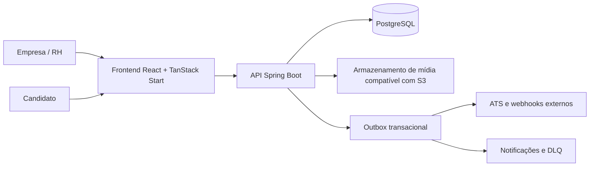

# Arquitetura

## Visão geral

O Praxis é uma aplicação web para criação e aplicação de avaliações situacionais. A arquitetura separa a experiência web, a API de domínio, o banco transacional e os canais de integração.

## Componentes

### Frontend

O frontend usa React, TypeScript, TanStack Start/Router e Tailwind. Ele atende dois contextos principais:

- Área autenticada da empresa: criação, publicação, acompanhamento e análise de avaliações.
- Fluxo público do candidato: acesso por link de tentativa e resposta às alternativas da avaliação.

### Backend

O backend é uma aplicação Spring Boot com Java 21. A aplicação habilita configuração tipada, execução assíncrona e tarefas agendadas. Os módulos de negócio organizam autenticação, simulações, jornadas, tentativas, resultados, integrações, billing, auditoria, privacidade e administração.

### Banco de dados

PostgreSQL é o banco de produção. O Flyway controla a evolução de schema, e o Hibernate opera com validação de estrutura em produção. Os testes de integração usam PostgreSQL via Testcontainers para respeitar particularidades das migrations.

### Integrações e entrega confiável

Resultados e eventos externos são processados por outbox transacional. A intenção é evitar que uma alteração confirmada no banco seja perdida quando o destino externo estiver indisponível. Entregas podem ser repetidas e, quando necessário, encaminhadas para uma fila de falhas operacionais (DLQ) para acompanhamento e reprocessamento.

## Fluxos relevantes

### Publicação de avaliação

1. O RH cria um rascunho e define contexto, competências, pesos, nós e alternativas.
2. O sistema valida a estrutura antes da publicação.
3. Uma versão publicada torna-se imutável.
4. Alterações posteriores devem ocorrer em novo rascunho derivado ou clonado.

### Aplicação para candidato

1. A empresa cria um link interno ou um ATS inicia uma tentativa.
2. O candidato acessa o fluxo público com o token da tentativa.
3. As respostas são registradas durante a execução.
4. Ao concluir, o backend calcula o score a partir das alternativas, pesos e competências configurados.
5. O resultado fica disponível para análise e pode ser entregue a integrações externas.

### Operação assíncrona

A aplicação possui tarefas agendadas e execução assíncrona. Elas suportam processos como entrega de eventos, regras operacionais de cobrança, retenção e relatórios de engajamento. A configuração e o comportamento efetivo dependem das variáveis de ambiente do deployment.

## Decisões de arquitetura

- **Score determinístico:** a pontuação é derivada de regras cadastradas, não de inferência por IA generativa.
- **Imutabilidade de versões publicadas:** preserva reprodutibilidade e contexto histórico.
- **Auditoria:** ações relevantes podem ser rastreadas no domínio operacional.
- **Integrações desacopladas:** a outbox reduz o acoplamento entre transação local e disponibilidade de serviços externos.
- **Multitenancy por empresa:** os dados e a operação são organizados por empresa autenticada.
