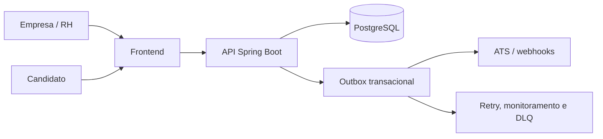

# Documentação técnica do Praxis

Este documento descreve a arquitetura e a operação do repositório com base na implementação atual. Ele não substitui decisões de segurança, infraestrutura, produto ou homologação de integrações.

## Visão geral

O Praxis é uma plataforma de avaliações situacionais para recrutamento. O fluxo principal é:

1. A empresa configura uma avaliação com competências, alternativas e pesos.
2. A plataforma valida a estrutura e publica uma versão imutável.
3. A pessoa candidata acessa a jornada pública e responde à avaliação.
4. O backend calcula a pontuação de forma determinística.
5. O recrutador consulta evidências e registra a decisão humana.

A aplicação não utiliza IA generativa para julgar candidatos. A decisão continua sob responsabilidade humana.

## Componentes

| Componente | Responsabilidade | Tecnologia principal |
| --- | --- | --- |
| Frontend | Interface para RH e pessoa candidata, rotas e comunicação com a API | React 19, TypeScript, TanStack Start/Router, Vite e Tailwind CSS |
| Backend | Regras de negócio, autenticação, API HTTP, persistência e integrações | Java 21, Spring Boot 3.5.3, Spring Security e JPA |
| Banco de dados | Dados transacionais e histórico de versões | PostgreSQL 17 |
| Migrações | Evolução versionada do esquema | Flyway |
| Integrações | ATS, webhooks, tokens por empresa e processamento operacional | Outbox transacional, retry e DLQ |
| Armazenamento | Conteúdo compatível com S3 | AWS SDK S3 |

## Arquitetura lógica



O frontend é servido pelo serviço `frontend` e se comunica internamente com `http://backend:8080`. O backend persiste no serviço `postgres`, na rede `praxis-network`.

## Estrutura relevante

```text
backend/                 API Spring Boot e testes
frontend/                aplicação React/TanStack Start
docs/                    documentação e guias operacionais
docs/screenshots/        convenções para capturas
scripts/                 validações locais e de CI
docker-compose.yml       composição local dos serviços
```

## Execução local com Docker Compose

Pré-requisitos:

- Docker com suporte ao Docker Compose;
- arquivo `.env` com as variáveis exigidas pelo Compose.

```bash
docker compose up --build
```

Serviços:

| Serviço | Endereço local |
| --- | --- |
| Frontend | `http://localhost` |
| Backend | `http://localhost:8080` |
| PostgreSQL | rede interna do Compose |

Para interromper:

```bash
docker compose down
```

Para remover também os dados locais:

```bash
docker compose down -v
```

## Configurações de ambiente

O Compose exige:

| Variável | Uso real |
| --- | --- |
| `POSTGRES_USER` | Usuário do PostgreSQL |
| `POSTGRES_PASSWORD` | Senha do PostgreSQL e do backend |
| `PRAXIS_JWT_SECRET` | Assinatura de JWT |

Também são suportadas:

| Variável | Padrão | Uso |
| --- | --- | --- |
| `PRAXIS_SECURITY_ENABLED` | `true` | Segurança do backend |
| `PRAXIS_PUBLIC_BASE_URL` | `http://localhost` | Base pública de links e resultados |
| `PRAXIS_CANDIDATE_PAGE_BASE_URL` | `http://localhost` | Página pública da pessoa candidata |

A autenticação Gupy e Recrutei usa tokens gerados na Central de Integrações. O backend persiste apenas o SHA-256 Base64URL em `integration_tokens`.

`PRAXIS_INTEGRATION_TOKEN` não é exigido pelo Compose e não autentica `/test/**`.

Não versione segredos reais em `.env`, configuração, documentação, imagens ou logs.

## Backend

O backend utiliza Java 21 e Spring Boot 3.5.3. As dependências principais incluem validação, JPA, Spring Security, Actuator, e-mail, Flyway, OpenAPI, S3, JWT e Apache Tika.

As migrações usam recursos específicos do PostgreSQL. Testes de integração usam PostgreSQL real com Testcontainers; H2 não deve ser tratado como substituto compatível das migrações.

Em produção, o Hibernate deve usar `validate`; a evolução do schema pertence ao Flyway.

## Integrações ATS

### Tokens

- token em claro retornado uma única vez;
- hash SHA-256 Base64URL persistido;
- isolamento por empresa e provider;
- providers atuais: Gupy, Recrutei e API própria.

### Gupy

O contrato de provedor externo está implementado e coberto por testes automatizados. Isso não equivale à homologação formal, que depende de execução em vaga real.

Referências:

- [Fonte canônica da integração Gupy](GUPY-FONTE-CANONICA.md);
- [Contrato implementado](INTEGRACAO-GUPY-PROVEDOR.md);
- [Centro de homologação](HOMOLOGACAO-GUPY.md).

### Outbox

A entrega assíncrona, os estados, o backoff, a classificação de falhas e o reprocessamento são documentados exclusivamente em [ARQUITETURA_OUTBOX_PATTERN.md](ARQUITETURA_OUTBOX_PATTERN.md).

## Frontend

O frontend usa React 19 com TanStack Start, TanStack Router e TanStack Query.

Scripts principais:

```bash
npm run dev
npm run build
npm run build:dev
npm run typecheck
npm run preview
npm run lint
npm run format
npm run test:access-control
```

`npm run format` altera arquivos; revise o diff antes do commit.

O build deve ser executado antes do typecheck porque o plugin do TanStack Router regenera `src/routeTree.gen.ts`, arquivo usado pelos contratos tipados de navegação.

## Qualidade e validação

```bash
# Frontend
cd frontend
npm ci
npm run build
npm run typecheck
npm run lint
npm run test:access-control

# Backend
cd ../backend
mvn -B -ntp verify

# Documentação, a partir da raiz
cd ..
python3 scripts/validate_docs.py
```

Os testes do backend podem exigir Docker por causa do Testcontainers.

## Convenções de mudança

- Crie migrations para alterações de schema.
- Preserve versões publicadas.
- Não exponha tokens, links públicos, resultados reais ou dados pessoais.
- Use dados fictícios ou anonimizados nas imagens.
- Atualize documentação quando mudar contrato público, operação ou configuração.
- Não descreva integração externa como homologada apenas porque endpoints locais existem.
- Não replique contratos externos em vários documentos.
- Mantenha links diretos para o portal da Gupy somente na fonte canônica.

## Referências

- [Visão geral](../README.md)
- [Índice](00-INDICE.md)
- [Fonte canônica Gupy](GUPY-FONTE-CANONICA.md)
- [Integração Gupy](INTEGRACAO-GUPY-PROVEDOR.md)
- [Homologação Gupy](HOMOLOGACAO-GUPY.md)
- [Arquitetura Outbox](ARQUITETURA_OUTBOX_PATTERN.md)
- [Implantação](IMPLANTACAO.md)
- [Operação](OPERACAO.md)
- [Capturas do README](screenshots/README.md)

Última revisão: 22/07/2026.
