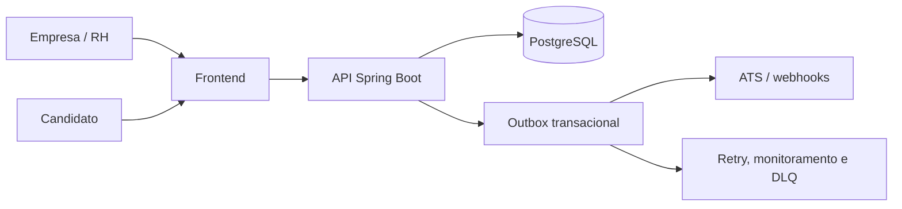

# Documentação técnica do Praxis

Este documento descreve a arquitetura e a operação do repositório com base na implementação atual. Ele não substitui decisões de segurança, infraestrutura ou produto que dependam do ambiente de implantação.

## Visão geral

O Praxis é uma plataforma de avaliações situacionais para recrutamento. O fluxo principal é:

1. A empresa configura uma avaliação com competências, alternativas e pesos.
2. A plataforma valida a estrutura e publica uma versão imutável.
3. O candidato acessa a jornada pública e responde à avaliação.
4. O backend calcula a pontuação de forma determinística.
5. O recrutador consulta as evidências e registra a decisão humana.

A aplicação não utiliza IA generativa para julgar candidatos. A decisão continua sob responsabilidade humana.

## Componentes

| Componente | Responsabilidade | Tecnologia principal |
| --- | --- | --- |
| Frontend | Interface para RH e candidato, rotas e comunicação com a API | React 19, TypeScript, TanStack Start/Router, Vite e Tailwind CSS |
| Backend | Regras de negócio, autenticação, API HTTP, persistência e integrações | Java 21, Spring Boot 3.5.3, Spring Security e JPA |
| Banco de dados | Dados transacionais e histórico de versões | PostgreSQL 17 |
| Migrações | Evolução versionada do esquema de dados | Flyway |
| Integrações | Entregas para ATS, webhooks e processamento operacional | Outbox transacional, retry e DLQ |
| Armazenamento de objetos | Suporte a conteúdo compatível com S3 | AWS SDK S3 |

## Arquitetura lógica



O frontend é servido pelo serviço `frontend` e se comunica internamente com o backend usando `http://backend:8080`. O backend persiste no serviço `postgres`, na rede Docker `praxis-network`.

## Estrutura relevante do repositório

```text
backend/                 API Spring Boot e testes
frontend/                aplicação React/TanStack Start
docs/                    documentação e guias operacionais
docs/screenshots/        convenções para capturas usadas no README
docker-compose.yml       composição local dos serviços
.env.example             modelo de variáveis locais
```

## Execução local com Docker Compose

Pré-requisitos:

- Docker com suporte ao Docker Compose.
- Arquivo `.env` configurado a partir de `.env.example`.

```bash
cp .env.example .env
docker compose up --build
```

Após a inicialização, os serviços ficam disponíveis em:

| Serviço | Endereço local |
| --- | --- |
| Frontend | `http://localhost` |
| Backend | `http://localhost:8080` |
| PostgreSQL | disponível apenas na rede interna do Compose por padrão |

Para interromper os serviços:

```bash
docker compose down
```

Para também remover o volume local do PostgreSQL:

```bash
docker compose down -v
```

> A remoção do volume apaga os dados locais persistidos pelo serviço `postgres`.

## Configurações de ambiente

O Compose exige as variáveis abaixo para iniciar o backend e o banco:

| Variável | Uso |
| --- | --- |
| `POSTGRES_USER` | Usuário do PostgreSQL |
| `POSTGRES_PASSWORD` | Senha do PostgreSQL e da fonte de dados do backend |
| `PRAXIS_INTEGRATION_TOKEN` | Token de autenticação para integrações |
| `PRAXIS_JWT_SECRET` | Segredo usado pela autenticação baseada em JWT |

Também são suportadas as configurações a seguir:

| Variável | Padrão no Compose | Uso |
| --- | --- | --- |
| `PRAXIS_SECURITY_ENABLED` | `true` | Ativa ou desativa a camada de segurança do backend |
| `PRAXIS_PUBLIC_BASE_URL` | `http://localhost` | URL pública base da aplicação |
| `PRAXIS_CANDIDATE_PAGE_BASE_URL` | `http://localhost` | URL base usada para jornadas de candidatos |

Não versione segredos reais em `.env`, arquivos de configuração, documentação, imagens ou logs.

## Backend

O backend utiliza Java 21 e Spring Boot 3.5.3. As dependências principais incluem validação, JPA, Spring Security, Actuator, e-mail, Flyway, OpenAPI via Springdoc, integração S3, JWT e Apache Tika.

As migrações usam recursos específicos do PostgreSQL. Por esse motivo, os testes de integração utilizam PostgreSQL real com Testcontainers; o H2 está restrito ao escopo de testes e não deve ser tratado como substituto compatível das migrações.

A estratégia de DDL usada pelo Compose é `validate`: o Hibernate valida o esquema existente, enquanto a evolução estrutural deve ocorrer por migrações Flyway.

## Frontend

O frontend usa React 19 com TanStack Start, TanStack Router e TanStack Query. Os scripts disponíveis em `frontend/package.json` são:

```bash
npm run dev
npm run build
npm run build:dev
npm run preview
npm run lint
npm run format
```

O build de produção é executado por `npm run build`. O comando `npm run format` aplica alterações nos arquivos; revise o diff antes de incluí-lo em um commit.

## Qualidade e validação

Antes de abrir um pull request, execute ao menos:

```bash
# Frontend
cd frontend
npm run lint
npm run build

# Backend
cd ../backend
mvn test
```

Os testes do backend exigem Docker disponível quando houver cenários com Testcontainers. A automação contínua descrita no repositório executa build e testes do backend com PostgreSQL real via Testcontainers, além do build do frontend, em pushes e pull requests para `main`.

## Convenções de mudança

- Crie migrations para qualquer alteração de esquema; não use atualização automática de DDL em produção.
- Preserve a imutabilidade das versões publicadas de avaliações.
- Não exponha tokens, links públicos de candidatos, resultados reais ou dados pessoais em capturas e documentação.
- Use dados fictícios ou anonimizados nas imagens do README.
- Documente mudanças de configuração, comportamento público ou integração junto com a implementação.

## Referências internas

- [Visão geral do produto](../README.md)
- [Guia de capturas para o README](screenshots/README.md)
