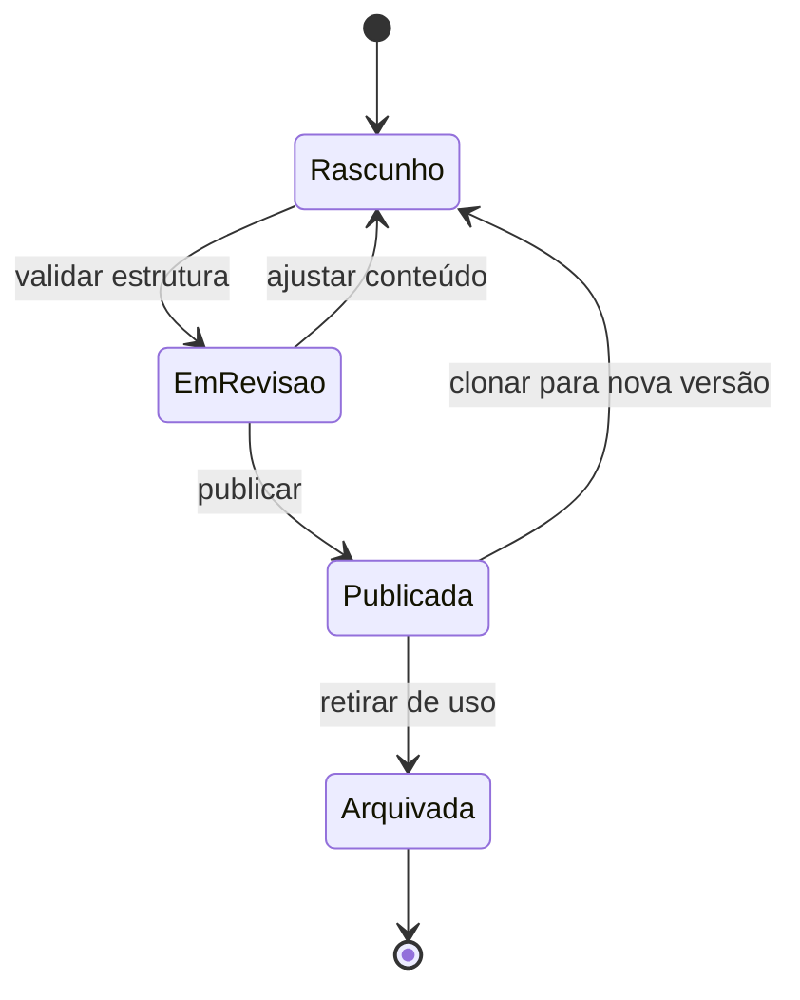
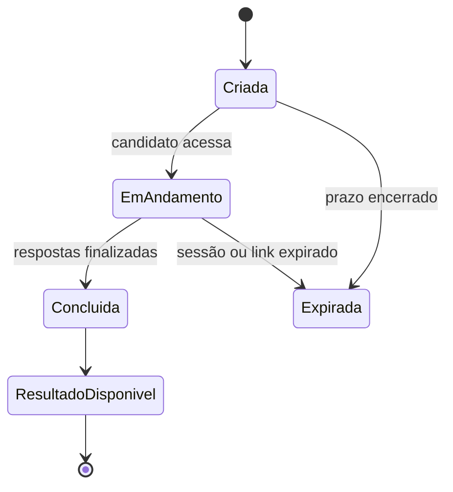

# Domínio do produto

## Conceitos centrais

| Conceito | Descrição |
| --- | --- |
| Empresa | Organização que usa o Praxis para operar avaliações e analisar resultados. |
| Usuário | Pessoa autenticada vinculada a uma empresa, com permissões de operação. |
| Avaliação | Estrutura de avaliação situacional criada para um cargo, contexto ou objetivo. |
| Versão | Estado versionado de uma avaliação. Versões publicadas são preservadas como histórico. |
| Blueprint | Definição de objetivo, competências, pesos e contexto da avaliação. |
| Competência | Critério observável usado na composição do score. |
| Nó / turno | Etapa ou situação apresentada durante a avaliação. |
| Alternativa | Resposta selecionável pelo candidato, vinculada a regras de pontuação. |
| Tentativa | Execução individual de uma avaliação por um candidato. |
| Resultado | Consolidação das respostas e do score calculado para uma tentativa. |
| Jornada | Encadeamento de múltiplas avaliações em um mesmo fluxo de candidato. |
| Integração | Configuração de comunicação com ATS, webhook ou API própria. |
| Entrega | Evento ou resultado enviado para um destino externo. |

## Regra de avaliação

O Praxis trabalha com avaliação situacional estruturada. O RH configura alternativas e regras de pontuação antes da aplicação. O score é calculado com base nas escolhas do candidato, nas competências e nos pesos registrados na versão aplicada.

O produto não usa LLM ou IA generativa para interpretar respostas livres ou decidir a elegibilidade de candidatos.

## Ciclo de vida da avaliação

A publicação deve ocorrer apenas após validação compatível com as regras configuradas. A versão publicada representa a referência histórica para tentativas realizadas nela.

## Ciclo de vida da tentativa

Os prazos de link e sessão são parametrizados por ambiente. A análise humana posterior não altera as respostas originais do candidato.

## Decisão humana

O resultado oferece evidências para análise do recrutador. A decisão de processo seletivo deve ser registrada como uma ação humana e contextualizada pela empresa, sem tratar o score como decisão automática isolada.