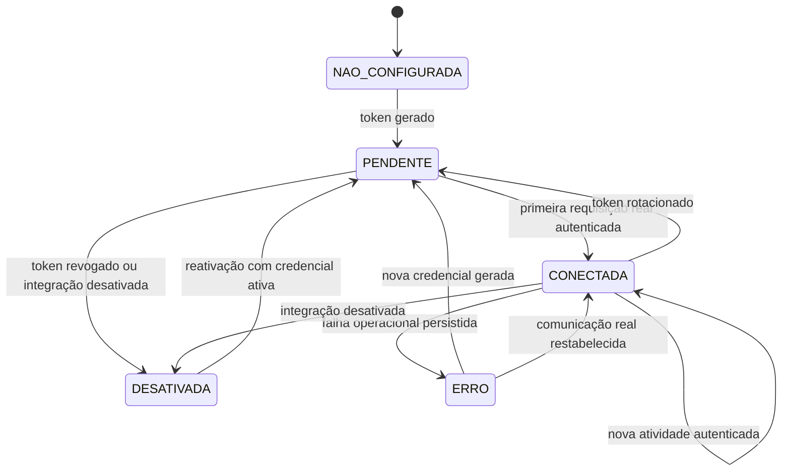

# REQ-INTEGRACOES-STATUS-CONEXAO-REAL

## Identificação

- **Título:** Diferenciar token configurado de integração ATS conectada
- **Área:** Central de Integrações
- **Provedores afetados:** Gupy e Recrutei
- **Tipo:** Correção funcional e de comunicação
- **Prioridade:** Alta
- **Estado:** Pendente de desenvolvimento
- **Origem da análise:** `main` no commit `0bad28e8f8ecfe802d708216ad8714180fdcd9c4`

## Problema

Atualmente, a ação **Testar conexão** não realiza comunicação com a Gupy ou com o Recrutei. O backend apenas verifica se existe um hash de token armazenado e, quando existe, altera o status da integração para `CONECTADA`. Em seguida, o frontend mostra a mensagem **Conexão ok**.

A existência de um token local comprova somente que uma credencial foi gerada no Práxis. Ela não comprova que:

- o token foi copiado para o painel do ATS;
- o ATS salvou a configuração;
- o ATS consegue autenticar no Práxis;
- o contrato HTTP entre o ATS e o Práxis está válido;
- uma requisição real foi recebida com sucesso.

Esse comportamento transmite ao usuário uma confirmação que o sistema não possui evidência técnica para fornecer.

## Objetivo

Garantir que a Central de Integrações diferencie claramente:

1. integração não configurada;
2. token gerado, aguardando uso pelo ATS;
3. integração comprovadamente ativa por uma comunicação real autenticada;
4. integração com erro conhecido;
5. integração desativada.

O sistema não deve apresentar **Conectada** ou **Conexão ok** apenas porque existe um token no banco.

## Escopo

Este requisito contempla:

- correção da regra de status da Gupy e do Recrutei;
- correção da ação atualmente chamada **Testar conexão**;
- transição automática para `CONECTADA` após requisição real autenticada;
- mensagens e badges da Central de Integrações;
- registro da evidência de conexão;
- auditoria das transições;
- testes automatizados de backend e frontend.

Este requisito não contempla:

- homologação completa do contrato oficial da Gupy;
- implementação de `callback_url`;
- correção do fluxo de reativação ou rotação de token;
- sincronização manual de candidatos ou resultados;
- criação de uma chamada externa para APIs administrativas do ATS que não façam parte do contrato atual.

## Conceitos

### Token configurado

Existe uma credencial ativa gerada pelo Práxis e armazenada somente como hash. Ainda não há evidência de que o ATS utilizou essa credencial.

### Conexão comprovada

O Práxis recebeu e processou com sucesso ao menos uma requisição real do provedor usando um Bearer token válido associado à empresa e ao provedor corretos.

### Requisição real válida

É uma requisição que:

- chega a um endpoint público do contrato do provedor;
- contém Bearer token válido;
- resolve corretamente empresa e provedor;
- passa pelas validações de autenticação;
- chega ao fluxo de aplicação sem falha de autenticação ou isolamento de empresa.

Para a Gupy, são evidências válidas, no mínimo:

- `GET /test`;
- `POST /test/candidate`;
- `GET /test/result/{resultId}`.

Para o Recrutei, devem ser considerados os endpoints equivalentes expostos pelo contrato do provedor.

Erros funcionais posteriores à autenticação, como teste inexistente ou payload inválido, podem registrar atividade autenticada, mas não devem ser contabilizados como entrega funcional concluída. A implementação deve distinguir **autenticação comprovada** de **operação concluída** na auditoria.

## Regras funcionais

### RF-01 — Geração do token

Ao gerar um token para Gupy ou Recrutei:

- a integração deve ficar com status `PENDENTE`;
- o token completo deve continuar sendo exibido uma única vez;
- a interface deve informar que o token precisa ser configurado no ATS;
- a interface não deve mostrar `CONECTADA`;
- a existência do hash não pode ser utilizada isoladamente como evidência de conexão.

Mensagem esperada:

> Token configurado — aguardando primeiro evento do ATS.

### RF-02 — Verificação manual de status

A ação atualmente chamada **Testar conexão** não deve alterar o status para `CONECTADA` com base apenas no hash do token.

Como o Práxis não possui, no contrato atual, uma chamada externa confiável para validar o painel da Gupy ou do Recrutei, a ação deve ser substituída por **Atualizar status** ou **Verificar atividade**.

Essa ação deve:

- consultar novamente o estado persistido da integração;
- não gerar tráfego fictício;
- não chamar um endpoint externo inexistente;
- não alterar `PENDENTE` para `CONECTADA` sem evidência real;
- não mostrar **Conexão ok** quando não houver atividade autenticada.

Quando houver token, mas nenhuma atividade real:

> Token configurado — aguardando primeiro evento do ATS.

Quando já houver atividade real válida:

> Integração conectada. Última atividade em {data e hora}.

### RF-03 — Primeira comunicação real

Após a primeira requisição autenticada válida do ATS:

- a integração deve mudar de `PENDENTE` para `CONECTADA`;
- a data da última atividade deve ser preenchida;
- o provedor e a empresa devem corresponder ao token utilizado;
- a transição deve ocorrer somente depois da autenticação bem-sucedida;
- a transição deve ser idempotente.

Requisições posteriores válidas devem atualizar a data da última atividade sem criar transições duplicadas de status.

### RF-04 — Token inválido

Uma requisição com token ausente, inválido, revogado ou pertencente a outro provedor:

- deve continuar sendo rejeitada pelo mecanismo de autenticação;
- não deve alterar a integração para `CONECTADA`;
- não deve atualizar a data da última atividade da empresa;
- não deve permitir inferência ou exposição de dados de outra empresa.

### RF-05 — Estado conectado

O status `CONECTADA` somente pode ser apresentado quando existir uma destas evidências:

1. requisição real autenticada recebida do ATS; ou
2. teste técnico externo realmente executado e validado, caso um provedor passe a oferecer endpoint oficial para isso no futuro.

A simples presença de `credentialsHash` ou `tokenPreview` não é evidência suficiente.

### RF-06 — Estado pendente

O status `PENDENTE` deve representar:

- token ativo gerado;
- nenhuma requisição real autenticada recebida desde a geração, rotação ou reativação da credencial.

A tela deve orientar o usuário a configurar o token no ATS e aguardar o primeiro evento.

### RF-07 — Rotação futura de token

Quando ocorrer rotação de token, a integração deve voltar para `PENDENTE` até que o novo token seja utilizado em uma requisição autenticada real.

Esta regra deve ser respeitada quando o fluxo de rotação for corrigido, embora a entrega completa da rotação não faça parte deste requisito.

### RF-08 — Desativação

Uma integração `DESATIVADA` não pode voltar a `CONECTADA` por atualização de tela ou verificação local de hash.

Somente um fluxo explícito de reativação, seguido de comunicação real com a credencial ativa, poderá estabelecer novamente o estado `CONECTADA`.

## Máquina de estados esperada



## Comportamento esperado no backend

### Serviço de gerenciamento

Na classe `IntegrationManagementService`:

- o método atual `testConnection` não deve marcar a integração como conectada apenas por encontrar `credentialsHash`;
- a operação deve ser somente leitura ou verificação de estado;
- o retorno deve refletir o estado persistido e a última atividade comprovada;
- o método pode ser renomeado internamente para representar melhor sua função, preservando compatibilidade de endpoint quando necessário.

### Registro de atividade

O método responsável por registrar atividade deve ser chamado somente após autenticação bem-sucedida do provedor.

Ao registrar atividade:

- atualizar `lastSyncAt` ou o campo equivalente de última atividade;
- alterar `PENDENTE` ou `ERRO` para `CONECTADA` quando a evidência for válida;
- manter `CONECTADA` em chamadas posteriores;
- nunca reativar automaticamente integração `DESATIVADA`;
- registrar auditoria da primeira conexão e das recuperações de erro.

### Resposta da API de integrações

A API deve continuar retornando informação suficiente para o frontend apresentar:

- status atual;
- existência de token configurado;
- prévia segura do token;
- data da última atividade autenticada;
- mensagem de erro, quando houver;
- ações disponíveis.

Não é obrigatório criar um novo campo se os campos existentes representarem essas informações sem ambiguidade. Caso seja adicionado um campo, recomenda-se:

```json
{
  "connectionEvidence": "NONE | TOKEN_ONLY | AUTHENTICATED_REQUEST | PROVIDER_HEALTHCHECK",
  "lastValidatedAt": "2026-07-13T18:30:00Z"
}
```

## Comportamento esperado no frontend

### Status `NAO_CONFIGURADA`

Badge:

> Não configurada

Ação principal:

> Gerar token

### Status `PENDENTE`

Badge:

> Token configurado · aguardando primeiro evento

Texto de apoio:

> Copie o token para o painel do ATS. A conexão será confirmada quando o Práxis receber a primeira requisição autenticada.

Ações permitidas neste requisito:

- ver configuração;
- gerar ou rotacionar token conforme as regras existentes;
- atualizar status.

Não exibir:

- **Conexão ok**;
- ícone visual de sucesso definitivo;
- texto que afirme que a integração já está operando.

### Status `CONECTADA`

Badge:

> Conectada

Texto complementar:

> Última atividade em {data e hora}.

### Ação de atualização

O botão deve utilizar uma destas denominações:

- **Atualizar status**; ou
- **Verificar atividade**.

Não utilizar **Testar conexão** enquanto não houver uma chamada técnica real ao provedor.

## Auditoria

Devem ser registrados eventos para:

- token gerado e integração colocada em `PENDENTE`;
- primeira requisição autenticada que estabelece `CONECTADA`;
- recuperação de `ERRO` para `CONECTADA` por nova atividade válida;
- tentativa manual de atualização de status, quando aplicável, sem registrar falso sucesso.

A auditoria da conexão deve conter, sem expor token:

- empresa;
- provedor;
- status anterior;
- status novo;
- data e hora;
- tipo de evidência;
- endpoint que originou a evidência;
- identificador de correlação, quando disponível.

## Critérios de aceite

### CA-01 — Token novo permanece pendente

**Dado** que uma empresa ainda não configurou a Gupy  
**Quando** gerar um token  
**Então** a integração deve ficar `PENDENTE`  
**E** a tela deve mostrar **Token configurado — aguardando primeiro evento do ATS**  
**E** não deve mostrar **Conexão ok**.

### CA-02 — Atualizar status não cria conexão

**Dado** que existe um token válido no banco  
**E** nenhuma requisição autenticada foi recebida  
**Quando** o usuário clicar em **Atualizar status**  
**Então** a integração deve continuar `PENDENTE`  
**E** nenhuma data de atividade deve ser criada artificialmente.

### CA-03 — Primeira chamada válida conecta

**Dado** que a integração está `PENDENTE`  
**Quando** a Gupy chamar `GET /test` com Bearer token válido  
**Então** a requisição deve ser processada normalmente  
**E** a integração deve mudar para `CONECTADA`  
**E** a data da última atividade deve ser registrada  
**E** a auditoria deve registrar a evidência da conexão.

### CA-04 — Token inválido não conecta

**Dado** que a integração está `PENDENTE`  
**Quando** uma requisição chegar com token inválido ou de outro provedor  
**Então** a requisição deve ser rejeitada  
**E** a integração deve continuar `PENDENTE`  
**E** a data da última atividade não deve ser atualizada.

### CA-05 — Requisições posteriores atualizam atividade

**Dado** que a integração está `CONECTADA`  
**Quando** outra requisição autenticada válida for recebida  
**Então** o status deve permanecer `CONECTADA`  
**E** a data da última atividade deve ser atualizada  
**E** não deve ser criado novo evento de primeira conexão.

### CA-06 — Integração desativada não reativa sozinha

**Dado** que a integração está `DESATIVADA`  
**Quando** o usuário atualizar a tela ou consultar o status  
**Então** ela deve permanecer `DESATIVADA`  
**E** não deve ser marcada como conectada pela existência de hash antigo.

### CA-07 — Comunicação visual verdadeira

**Dado** qualquer estado da integração  
**Quando** a Central de Integrações for exibida  
**Então** o texto e o ícone devem corresponder à evidência realmente disponível  
**E** nenhum estado de sucesso deve ser apresentado sem comunicação autenticada comprovada.

## Testes obrigatórios

### Backend

Criar ou ajustar testes para validar:

1. gerar token cria ou mantém integração em `PENDENTE`;
2. consulta manual não altera `PENDENTE` para `CONECTADA`;
3. `credentialsHash` sem atividade não representa conexão;
4. primeira requisição Gupy autenticada muda para `CONECTADA`;
5. primeira requisição Recrutei autenticada muda para `CONECTADA`;
6. token inválido não altera status nem última atividade;
7. integração desativada não é reativada por `recordActivity`;
8. chamadas posteriores atualizam a última atividade;
9. transição e metadados são registrados na auditoria;
10. isolamento entre empresas e provedores permanece válido.

### Frontend

Criar ou ajustar testes para validar:

1. status `PENDENTE` mostra a mensagem de espera;
2. o texto **Conexão ok** não aparece sem evidência real;
3. o botão é apresentado como **Atualizar status** ou **Verificar atividade**;
4. status `CONECTADA` mostra a última atividade;
5. refetch não altera visualmente o estado sem resposta correspondente do backend;
6. os estados de loading e erro não produzem confirmação falsa.

## Definição de pronto

O requisito estará concluído quando:

- backend e frontend obedecerem às regras deste documento;
- os testes automatizados obrigatórios estiverem implementados e aprovados;
- não houver caminho que transforme token armazenado em conexão comprovada sem atividade real;
- as mensagens **Testar conexão** e **Conexão ok** forem removidas do fluxo que apenas consulta o estado local;
- a documentação técnica da Central de Integrações estiver alinhada ao novo significado de `PENDENTE` e `CONECTADA`;
- o build do backend e do frontend estiver aprovado;
- não houver conflito com a versão atual da `main`.
